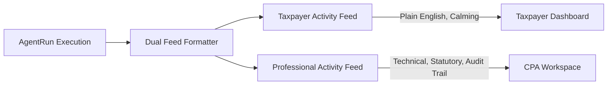

# Phase 5 — Agent Telemetry, Budget Guardrails & Dual Activity Feeds

## 1. Executive Summary

Autonomous Tax OS Phase 5 implements strict operational controls to prevent cost blowouts and deliver role-appropriate transparency to both taxpayers and tax professionals.

---

## 2. Hard Budget Guardrails ($5.00 Cap per Tax Return)

To ensure unit economics remain profitable for fintech and B2B SaaS deployments, the runtime enforces a hard budget ceiling:

### Guardrail Policy:
- **Maximum Cost per Return**: **$5.00 USD**.
- **Average Cost Target**: **< $0.05 USD** per return.
- **Enforcement Mechanism**: The `AgentTelemetryService` monitors cumulative spend across all `AgentRun` records for a `TaxCase`. If spend approaches or exceeds the budget cap, non-essential AI reasoning tasks are halted and deferred to human review.

```typescript
export class AgentTelemetryService {
  public static readonly CASE_BUDGET_CAP_USD = 5.00;

  public static async getTelemetrySummary(taxCaseId: string) {
    const runs = await prisma.agentRun.findMany({ where: { taxCaseId } });
    const totalCostUsd = runs.reduce((sum, r) => sum + (r.costUsd || 0), 0);
    return {
      totalRuns: runs.length,
      totalCostUsd: Math.round(totalCostUsd * 10000) / 10000,
      budgetExceeded: totalCostUsd > this.CASE_BUDGET_CAP_USD,
      averageLatencyMs: Math.round(runs.reduce((sum, r) => sum + (r.latencyMs || 0), 0) / (runs.length || 1))
    };
  }
}
```

---

## 3. Dual Activity Feeds (Simple Outside, Powerful Inside)

Every agent action generates two parallel representations:



### Feed Comparison:

| Feature / Step | Taxpayer Activity Feed | Professional Activity Feed |
| :--- | :--- | :--- |
| **Merchant Categorization** | "Organized 42 transactions from your Chase checking account." | `TRANSACTION_CLASSIFICATION_AGENT` classified 42 debit lines. 29 business candidates flagged under Schedule C Category 18. |
| **Deduction Discovery** | "Found $3,450 in software and office expenses for your design business." | `DEDUCTION_HUNTER` proposed $3,450 write-off under IRC § 162. Backed by Tier 2 bank records, confidence 0.95. |
| **Vehicle Mileage** | "Reviewed your driving log and applied the standard mileage rate." | `VEHICLE_MILEAGE_AGENT` applied Rev. Proc. 2025-XX rate ($0.70/mi) for 4,200 miles ($2,940). Verified contemporaneous log under IRC § 274(d). |
| **Adversarial Check** | "Double-checked your tax return against IRS audit rules." | `IRS_CHALLENGER_AGENT` evaluated ATG red flags; disallowance risk scored at 0.08 (low). |
| **State Conformity** | "Updated your California return for state-specific tax differences." | `CONFORMITY_AGENT` executed CRTC § 17215.4 HSA add-back of $3,850 to California starting AGI. |
