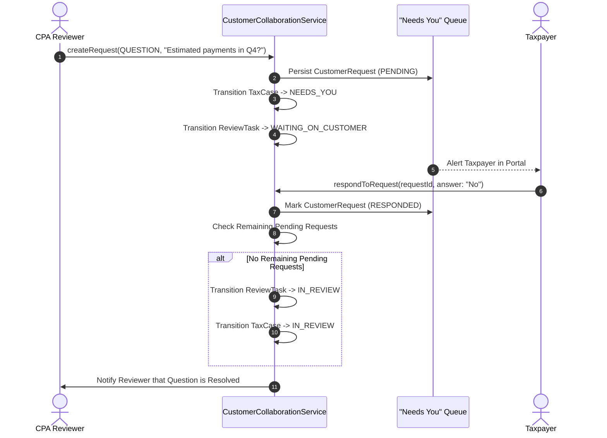

# Phase 6: Customer-Professional Collaboration & "Needs You" Queue

## 1. Overview
The "Needs You" queue serves as the single source of truth for all outstanding taxpayer actions. Instead of unstructured email threads or open chats, all communication is structured through persisted `CustomerRequest` records.

---

## 2. Customer Request Types

```prisma
enum CustomerRequestType {
  QUESTION              // Clarification on factual matters (e.g. business mileage)
  DOCUMENT_REQUEST      // Missing tax form (e.g. 1098 mortgage interest)
  CONFIRMATION          // Attestation of fact (e.g. foreign account ownership)
  SIGNATURE_REQUEST     // Form 8879 taxpayer signature authorization
  PAYMENT_INFORMATION   // Direct deposit routing confirmation
}
```

---

## 3. Workflow Lifecycle



---

## 4. Role-Based Message Scoping

Case communications are partitioned by `MessageRecipientScope` in `TaxCaseMessage`:

| Scope | Visible Roles | Use Case |
| :--- | :--- | :--- |
| `ALL` | Everyone (Taxpayer, Support, Preparers, Reviewers, Counsel) | Public notices, milestone greetings |
| `CUSTOMER_REVIEWER` | Taxpayer + Preparers/Reviewers | Clarification requests, document feedback |
| `REVIEWER_OPS` | Customer Support + Reviewers | Internal operational scheduling notes |
| `REVIEWER_SENIOR` | Senior Reviewers (Level 2+) | Technical preparer feedback, second-review notes |
| `REVIEWER_ATTORNEY` | Tax Attorneys + Super Admins | Confidential legal work product, penalty advice |
