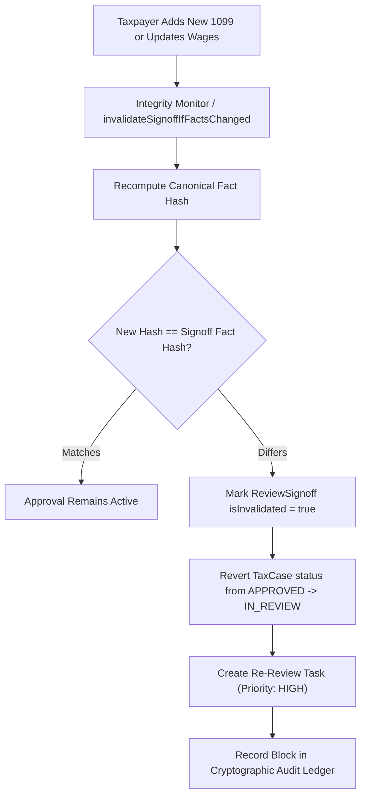

# Phase 6: Final Return Review, 14-Point Readiness Gate & Invalidation Invariant

## 1. Readiness Gate Prerequisites
Before any return can receive final professional approval, `FinalReturnReviewService.evaluateReadiness` executes pre-flight checks:

1. **No Open Blocking Tasks**: All non-final review tasks (`DEDUCTION_REVIEW`, `STATE_REVIEW`, `EVIDENCE_REVIEW`, `LEGAL_REVIEW`) must be in status `APPROVED` or `COMPLETED`.
2. **No Unresolved High-Risk Positions**: All positions with `riskScore > 0.6` or status `CHALLENGED` must be explicitly approved.
3. **Valid Deterministic Run**: Latest `TaxCalculationRun` must exist with status `COMPLETED`.
4. **Deterministic Fact Fingerprint**: Generates SHA-256 hash of all canonical `TaxFact` rows.

---

## 2. Mandatory 14-Point Statutory Checklist

Per Circular 230 and AICPA Statements on Standards for Tax Services (SSTS), the reviewing professional must certify each item:

| # | Checklist Item | Description |
| :--- | :--- | :--- |
| **1** | `identityVerified` | Taxpayer and spouse identity authenticated; SSN/ITIN verified |
| **2** | `filingStatusVerified` | Single, MFJ, MFS, HOH, or QSS confirmed against marital status |
| **3** | `dependentsResolved` | Qualifying child / relative tests verified under IRC § 152 |
| **4** | `incomeReconciled` | W-2, 1099, K-1, Schedule C, Schedule D income tied to source documents |
| **5** | `withholdingReconciled` | Federal and state withholdings verified against official forms |
| **6** | `estimatedPaymentsConfirmed` | Form 1040-ES and state voucher payments verified against bank transcripts |
| **7** | `materialDeductionsReviewed` | Above-the-line and Schedule A/C/E deductions substantiated |
| **8** | `creditsReviewed` | CTC, EITC, clean vehicle, education, and child care credits validated |
| **9** | `stateResidencyResolved` | Resident, non-resident, or part-year status established |
| **10** | `multiStateSourcingResolved` | State wage allocation and business apportionment validated |
| **11** | `calculationValidationPassed` | Deterministic tax engine invariants verified; refund/due mutually exclusive |
| **12** | `noUnresolvedHighRiskPositions` | No open IRS challenger disputes or unaddressed penalty exposures |
| **13** | `notesComplete` | Comprehensive workpaper documentation completed by reviewer |
| **14** | `evidenceAttached` | Source documents and receipts linked in Evidence Graph |

---

## 3. Professional Signoff Persistence

When approved, `FinalReturnReviewService.executeFinalSignoff` persists an immutable record:

```prisma
model ReviewSignoff {
  id                 String    @id @default(uuid())
  taxCaseId          String
  reviewVersion      Int       @default(1)
  approvedByUserId   String
  approvedAt         DateTime  @default(now())
  calculationRunId   String
  ruleSetVersion     String
  inputFactHash      String    // Canonical SHA-256 fingerprint
  checklistResults   Json      // Snapshot of 14 checklist items
  isInvalidated      Boolean   @default(false)
  invalidatedAt      DateTime?
  invalidationReason String?
  createdAt          DateTime  @default(now())
}
```

---

## 4. Invariant: Post-Approval Mutation Invalidation

> **Core System Invariant**: If ANY underlying `TaxFact` or `TaxPosition` is added, modified, or deleted after professional approval, the signoff is **immediately invalidated**.


