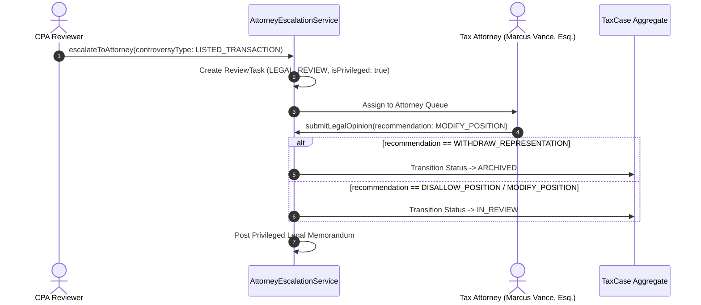

# Phase 6: Legal Escalation, Tax Controversy & Attorney-Client Privilege

## 1. Overview
When a tax return involves potential civil or criminal controversy, fraud risk, undisclosed foreign assets, or abusive tax shelter transactions, ordinary tax preparation procedures cease. TaxOS routes the case to licensed Tax Attorneys under strict attorney-client privilege isolation.

---

## 2. Escalation Triggers

`AttorneyEscalationService.escalateToAttorney` is triggered upon detection of:
1. **Fraud Risk**: Willful understatement or intentional disregard of rules.
2. **Listed Transactions**: Transactions of interest or listed reportable transactions under Treas. Reg. § 1.6011-4 (e.g. Notice 2007-83, Notice 2017-10).
3. **Foreign Asset Non-Disclosure**: Undisclosed foreign accounts (FBAR / FinCEN 114) requiring voluntary disclosure programs (VDP).
4. **State Nexus Disputes**: Constitutional challenges under the Commerce Clause or Due Process Clause.
5. **Civil Penalty Exposure**: Substantial understatement (IRC § 6662) or civil fraud (IRC § 6663) exposures.

---

## 3. Attorney-Client Privilege Isolation

### Authoring Protection:
Only licensed Tax Attorneys (`UserRole.ATTORNEY`) and Super Admins can author messages marked `isPrivilegedLegal: true`. Any attempt by non-lawyers throws `PRIVILEGE_VIOLATION`.

### Read-Side Isolation:
- **Taxpayer (Client)**: Blocked from internal attorney workpapers unless explicitly released by counsel.
- **Customer Support**: Strictly blocked from all privileged messages.
- **Preparers / CPAs**: Blocked from confidential legal counsel work product.
- **Audit Ledger**: Audit event metadata notes the controversy type and fact that an escalation occurred, but **never exposes raw privileged legal memorandum text**.

---

## 4. Legal Opinion Workflow

