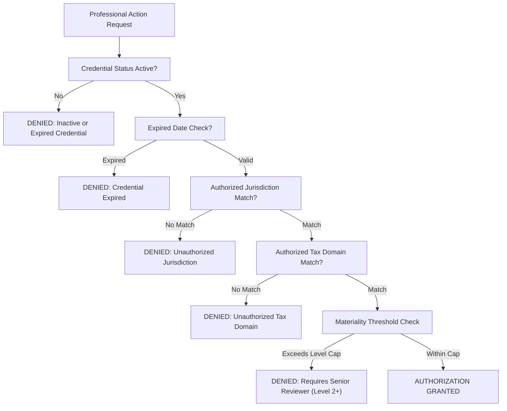

# Phase 6: Human Professional Credential Model & Authorization Governance

## 1. Architectural Philosophy
In Autonomous Tax OS, credentialed human professionals do **not** recreate tax returns from scratch. Automated multi-agent intelligence prepares returns, validates statutory rules, and reconciles calculations. Human professionals (CPAs, Enrolled Agents, Tax Attorneys, Senior Reviewers) are deployed strategically to review:
1. Material tax positions and exceptions.
2. High-uncertainty facts and ambiguous deductions.
3. Statutory elections and state conformity nuances.
4. Mandatory final return signoffs per Circular 230 and state board rules.

Crucially, both AI agents and human professionals operate on the **exact same canonical `TaxCase`, `TaxFact`, `TaxPosition`, `Evidence`, and `TaxCalculationRun` records**.

---

## 2. Professional Profile Schema

The professional entity model is persisted in PostgreSQL via Prisma (`ProfessionalProfile`):

```prisma
model ProfessionalProfile {
  id                      String             @id @default(uuid())
  userId                  String             @unique
  user                    User               @relation(fields: [userId], references: [id], onDelete: Cascade)
  organizationId          String?
  credentialType          CredentialType     @default(CPA)
  credentialNumber        String             // PTIN, State CPA License #, Bar #
  credentialState         String?            // "CA", "NY", "TX", etc.
  credentialStatus        CredentialStatus   @default(ACTIVE)
  credentialExpiration    DateTime?
  ptin                    String?            // IRS Preparer Tax Identification Number
  efin                    String?            // Electronic Filing Identification Number
  stateBarOrBoard         String?
  authorizedJurisdictions String[]           // ["US-FED", "US-CA", "US-NY"]
  authorizedTaxDomains    String[]           // ["INCOME_TAX", "SALES_TAX", "PAYROLL_TAX"]
  reviewLevel             Int                @default(1) // 1 = Preparer, 2 = Senior Reviewer, 3 = Partner/Counsel
  qualityStatus           String             @default("GOOD_STANDING")
  qualityScore            Float              @default(100.0)
  availabilityStatus      AvailabilityStatus @default(AVAILABLE)
  capacity                Int                @default(25)
  maxActiveCaseCapacity   Int                @default(25)
  currentActiveCases      Int                @default(0)
  supervisorId            String?
  createdAt               DateTime           @default(now())
  updatedAt               DateTime           @updatedAt
}
```

---

## 3. Professional Review Levels

| Level | Designation | Qualifications | Permitted Actions | Materiality Cap |
| :--- | :--- | :--- | :--- | :--- |
| **Level 1** | Staff Preparer / Junior Reviewer | CTEC, AFSP, Junior EA | Standard W-2 / Schedule C position reviews, document verification | Up to \$50,000 |
| **Level 2** | Senior Reviewer | Active CPA, EA (5+ yrs) | Complex multi-state reviews, QA sampling, final return approval | Up to \$500,000 |
| **Level 3** | Partner / Legal Counsel | Managing CPA, Tax Attorney | High-net-worth positions, tax controversy, fraud risk opinions, unlimited signoff | Unlimited |

---

## 4. Review Authorization Engine

Authority is evaluated dynamically by `ReviewAuthorizationEngine.evaluateAuthorization(...)`:



### Statutory Invariants Enforced:
1. **Active License Verification**: Reviewers with status `EXPIRED`, `SUSPENDED`, or `PENDING_VERIFICATION` are hard-blocked from taking review actions.
2. **Jurisdiction Boundary Enforcement**: A California CPA cannot approve a New York return unless their profile contains explicit `US-NY` authority.
3. **Domain Boundary Enforcement**: An Income Tax CPA cannot sign off on Sales Tax returns without `SALES_TAX` credential authorization.
4. **Circumvention Prevention**: All API actions pass through server-side authorization gates regardless of client state.
