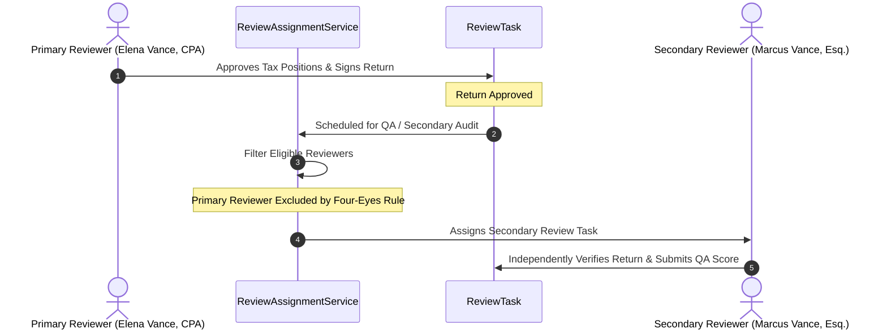

# Phase 6: Intelligent Review Routing & Workload Allocation

## 1. Multi-Dimensional Routing Architecture
`ReviewAssignmentService` routes tasks by matching multi-criteria parameters across active professional staff. Rather than relying on static round-robin queues, TaxOS computes dynamic suitability scores based on:

1. **Credential Authority**: Match between task requirements (`requiredRole`, `jurisdiction`, `taxDomain`) and reviewer profile.
2. **Current Active Capacity**: Utilization ratio `currentActiveCases / maxActiveCaseCapacity`. Over-capacity professionals are automatically excluded.
3. **Case Continuity**: Reviewers who previously completed tasks on the same `TaxCase` receive a priority bonus (+30 points) to minimize context switching.
4. **Availability Status**: Only reviewers marked `AVAILABLE` in their `ProfessionalProfile` receive assignments.
5. **Four-Eyes Separation**: For secondary review and Quality Assurance, primary preparers are strictly excluded from reviewing their own work.

---

## 2. Candidate Matching Scoring Formula

```math
\text{Suitability Score} = 100 - \left(\frac{\text{Active Cases}}{\text{Max Capacity}} \times 50\right) + \text{Continuity Bonus (30)} + (\text{Review Level} \times 5)
```

### Algorithm Walkthrough:
```typescript
const utilization = activeCases / maxCapacity;
let score = 100 - utilization * 50;
if (hasContinuity) score += 30;
score += profile.reviewLevel * 5;
```

---

## 3. Assignment Modes

### 1. Automated Dynamic Assignment (`autoAssignTask`)
- Evaluates candidate pool for a given `taskId`.
- Selects highest-scoring candidate.
- Atomically increments `currentActiveCases` for the selected reviewer.
- Transitions task status from `UNASSIGNED` to `ASSIGNED`.
- Appends cryptographic block to `AuditEvent` ledger.

### 2. Supervisory Manual Assignment (`manualAssignTask`)
- Allows Firm Admins, Case Managers, and Senior Reviewers to explicitly assign tasks.
- Enforces hard authorization checks via `ReviewAuthorizationEngine.assertAuthorized`.
- Validates capacity ceiling: if `currentActiveCases >= maxCapacity`, the request is aborted with `CAPACITY_EXCEEDED`.
- Updates assigned workload counters atomically across old and new assignees.

### 3. Task Release / Unassignment (`unassignTask`)
- Returns task to `UNASSIGNED` queue.
- Decrements reviewer's `currentActiveCases`.
- Records audit trace.

---

## 4. Four-Eyes Separation Principle


