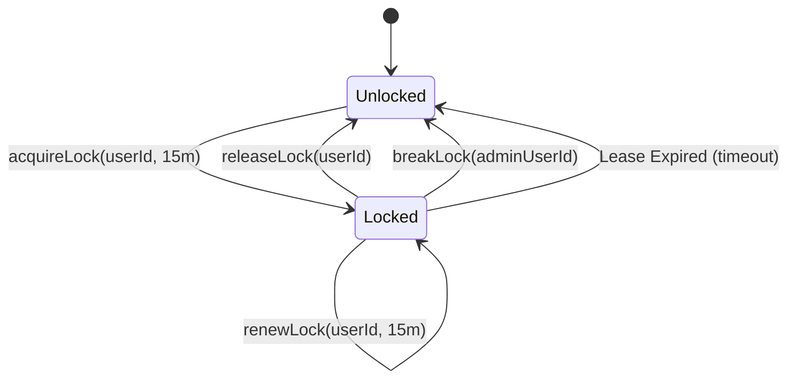
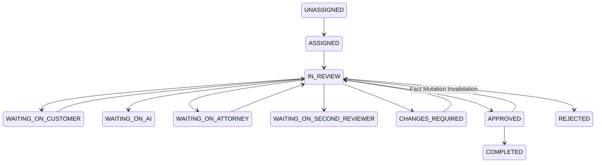

# Phase 6: Human Review Workflows, Concurrency Locks & Recalculation Engine

## 1. Concurrency Control: Lease-Based Case Locks
To prevent conflicting simultaneous writes between human professionals, AI workers, and taxpayer document uploads, `CaseLockService` provides distributed lease locking on the `TaxCase` aggregate:

- **Default Lease Duration**: 15 minutes.
- **Heartbeat Renewal**: Active leaseholders renew locks every 5–10 minutes via `renewLock`.
- **Voluntary Release**: Releasing a case lock clears the lock record immediately.
- **Supervisory Break-Lock**: Senior Reviewers, Firm Admins, and Super Admins can break active locks with audit justification; junior reviewers and taxpayers are refused.
- **Optimistic Concurrency**: Any mutation attempt without holding the active lock throws `CASE_LOCKED`.

---

## 2. Review Task State Machine
`ReviewTaskStateMachine` enforces strict, auditable state transitions across the 13 review lifecycle states:

---

## 3. Position Review Actions

When reviewing a proposed tax position, human professionals have 4 authoritative actions:

### 1. `APPROVE`
- Verifies statutory basis and substantiating evidence.
- Marks `TaxPosition.status = 'APPROVED'`.
- Persists immutable `TaxDecision` with cryptographic SHA-256 decision hash.

### 2. `MODIFY`
- Reviewer adjusts amount, category, or citation.
- **Deterministic Recalculation Invariant**: Manual editing of calculation outputs is strictly prohibited. The system updates the position/fact and triggers `CalculationRunService.executeAndPersistRun(taxCaseId)` to recalculate federal and state tax deterministically.
- Records `ProfessionalCorrection` in PostgreSQL for AI feedback learning.
- Invalidates any prior `ReviewSignoff` records.

### 3. `REJECT`
- Disallows deduction or credit.
- Marks `TaxPosition.status = 'REJECTED'`.
- Records `ProfessionalCorrection`.
- Triggers deterministic recalculation.

### 4. `REQUEST_INFO`
- Reviewer requires taxpayer clarification.
- Generates `CustomerRequest`.
- Transitions review task to `WAITING_ON_CUSTOMER` and `TaxCase` to `NEEDS_YOU`.
