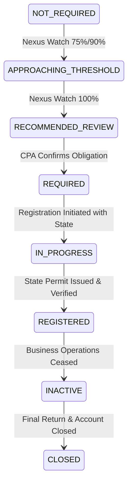

# Phase 7 — Sales Tax Registration & Filing Frequencies

## 1. Overview
The `RegistrationService` (`src/server/services/salesTax/registration/registrationService.ts`) manages the multi-state sales tax permit lifecycle for organizations, orchestrating state account numbers, statutory filing frequencies, and credentials without unauthorized automatic state registrations.

---

## 2. SalesTaxRegistration Model
```prisma
model SalesTaxRegistration {
  id                   String             @id @default(uuid())
  organizationId       String
  stateCode            String             // "US-CA", "US-NY", "US-NJ", "US-IL", "US-MA"
  accountNumber        String             // Encrypted state permit number
  registrationDate     DateTime
  effectiveDate        DateTime
  filingFrequency      FilingFrequency    @default(QUARTERLY) // MONTHLY, QUARTERLY, ANNUAL
  filingMethod         String             @default("ELECTRONIC")
  status               RegistrationStatus @default(REGISTERED)
  credentialsReference String?            // Ref to secure credential store
  lastVerifiedAt       DateTime?
}
```

---

## 3. Registration Lifecycle State Machine


---

## 4. Human-in-the-Loop Registration Workflow
> **Core Legal Invariant**: Autonomous Tax OS **never automatically registers a legal entity with a state tax department without explicit human review and executive client authorization**.

When economic nexus reaches 100% or physical nexus is established:
1. `NexusEngine` generates a `TaxTask` (`SALES_TAX_REGISTRATION_[STATE]`).
2. A credentialed **Sales Tax Reviewer** evaluates the determination against state voluntary disclosure agreement (VDA) rules and past exposure.
3. The business officer confirms legal entity details and authorizes registration.
4. The registration is submitted and verified via state portals (e.g., CDTFA, NYS DTF, NJ Division of Taxation, MyTax Illinois, MassTaxConnect).

---

## 5. Filing Frequency Dynamics
Filing frequencies are assigned by state taxing authorities based on estimated annual tax liability:
- **Annual**: Annual liability < \$1,000 (standard for small/occasional filers).
- **Quarterly**: Annual liability between \$1,000 and \$10,000 (default for emerging businesses).
- **Monthly**: Annual liability > \$10,000 (mandatory for high-volume merchants).
- **Prepayments**: Very high volume filers (e.g., CA > \$17,000/month) require quarterly returns with monthly prepayments.
