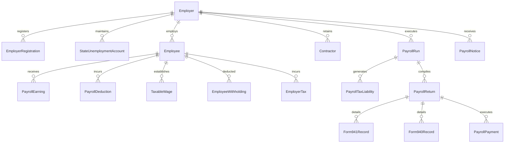

# Autonomous Tax OS — Phase 8: Production Payroll Tax Domain Model

## 1. Architectural Philosophy & Principles
In Autonomous Tax OS, payroll tax is engineered as a first-class, mission-critical tax domain alongside Income Tax and Sales & Use Tax.

### Core Non-Negotiable Invariants:
1. **Deterministic Execution**: Authoritative payroll tax calculations are strictly deterministic and rule-driven. Gross wages are never multiplied by an approximate percentage.
2. **AI Agent Role Boundaries**: AI agents orchestrate ingestion, detect anomalies, investigate variances, evaluate statutory worker classification risks, and route exceptions—**they never invent, guess, or hallucinate withholding amounts**.
3. **Multi-Jurisdiction Coexistence**: Federal, state income tax, state disability, paid family leave, and unemployment insurance are calculated according to each jurisdiction's exact statutory wage base and formula.
4. **Exact Pre-Tax Hierarchy**: Deductions under IRC § 125, IRC § 402(g), and IRC § 3121(a)(5)(A) reduce wage bases strictly according to statutory taxability rules.

---

## 2. Relational Schema & Entities
Phase 8 introduces 24 relational database models and 15 domain enums to PostgreSQL:

### Key Models:
- **`Employer`**: Core tenant organization entity with EIN, entity type (`C_CORP`, `S_CORP`, `LLC`, `PARTNERSHIP`), headquarters state, and registered jurisdictions.
- **`EmployerRegistration`**: Multi-jurisdiction tax account numbers (Federal EIN, California EDD account, New York WT, etc.).
- **`StateUnemploymentAccount`**: State SUI employer account numbers and experience tax rates (e.g., CA 3.4%, NY 4.1%).
- **`Employee`**: Complete worker profile with encrypted SSN, resident state, work location state, W-4 elections (filing status, multiple jobs checkbox, Step 3 credits, Step 4 adjustments), and state-specific allowance configurations.
- **`Contractor`**: Independent contractor profile with encrypted SSN/FEIN, 1099-NEC classification, and backup withholding settings.
- **`PayrollRun`**: Pay period run container linking gross wages, net pay, total employee withholdings, total employer liabilities, deposit frequencies, and ACH trace metadata.
- **`TaxableWage`**: Granular per-period and cumulative wage bases segregated by tax type (`FEDERAL_WITHHOLDING`, `FICA_OASDI`, `FICA_MEDICARE`, `FUTA`, `STATE_WITHHOLDING`, `STATE_UNEMPLOYMENT`).
- **`PayrollReturn`**: Official statutory filings (Form 941, Form 940, state equivalents) with two-party authorization lifecycle states (`DRAFT` $\to$ `APPROVED` $\to$ `AUTHORIZED_BY_TAXPAYER` $\to$ `FILED`).

---

## 3. Statutory Pre-Tax Deduction Exemption Matrix

| Deduction Type | Statutory Authority | FIT Taxable? | FICA OASDI? | FICA Medicare? | FUTA Taxable? | SIT Taxable? |
| :--- | :--- | :---: | :---: | :---: | :---: | :---: |
| **Section 125 Medical/Dental/Vision** | IRC § 125 | **No** (Exempt) | **No** (Exempt) | **No** (Exempt) | **No** (Exempt) | **No** (Exempt) |
| **Health Savings Account (HSA - EE)** | IRC § 223 / § 125 | **No** (Exempt) | **No** (Exempt) | **No** (Exempt) | **No** (Exempt) | **No** (CA/NJ Taxable) |
| **401(k) / 403(b) Retirement** | IRC § 402(g) / § 3121(a)(5)(A) | **No** (Exempt) | **YES** (Subject) | **YES** (Subject) | **YES** (Subject) | **No** (Exempt) |
| **Commuter / Transit Benefit** | IRC § 132(f) | **No** (Up to cap) | **No** (Up to cap) | **No** (Up to cap) | **No** (Up to cap) | **No** (Up to cap) |
| **Post-Tax Roth 401(k)** | IRC § 402A | **YES** | **YES** | **YES** | **YES** | **YES** |
| **Post-Tax Wage Garnishment** | CCPA / Court Order | **YES** | **YES** | **YES** | **YES** | **YES** |

Each pay calculation independently executes `WageBaseService.computeTaxableWages`, creating distinct immutable line items for each wage base.
