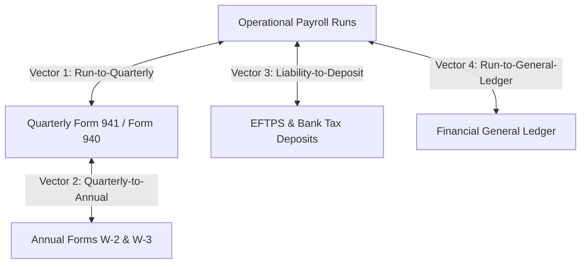

# Autonomous Tax OS — Phase 8: Four-Way Payroll Reconciliation Engine

## 1. Overview
Payroll tax compliance requires continuous multidirectional reconciliation between operational payroll runs, tax returns, banking deposits, and financial general ledgers.

---

## 2. The Four Reconciliation Vectors

### Vector 1: Payroll Runs $\longleftrightarrow$ Form 941 Quarterly Returns
- Confirms that the aggregate gross wages, FIT withholding, and FICA taxes across all individual pay runs in a calendar quarter reconcile to the penny with Form 941 Lines 2, 3, and 5e.
- Catches mid-quarter adjustments, manual gross pay overrides, or unrecorded bonus runs.

### Vector 2: Form 941 Quarterly Returns $\longleftrightarrow$ Form W-2 / W-3 Annual Returns
- Reconciles the four quarters of Form 941 against the employer's Form W-3 transmittal.
- Guarantees SSA wage reporting matches IRS employment tax reporting.

### Vector 3: Tax Liabilities $\longleftrightarrow$ Bank Tax Deposits
- Reconciles statutory tax liabilities recorded per pay run with cleared EFTPS and state ACH debit transactions.
- Highlights unremitted liabilities before statutory penalty deadlines.

### Vector 4: Payroll Runs $\longleftrightarrow$ General Ledger (GL)
- Reconciles total payroll expense, payroll tax expense, and payroll tax liabilities against accounting general ledger trial balances.
- Identifies unposted journal entries or manual adjustments.

---

## 3. Discrepancy Codes & Autonomous Escalation
When an accounting discrepancy is detected, the `PayrollReconciliationEngine` generates a structured anomaly record with a specific diagnostic code:
- `FIT_WITHHOLDING_MISMATCH`: Difference between pay run FIT and Form 941 Line 3.
- `FICA_TAX_MISMATCH`: Difference between pay run FICA and Form 941 Line 5e.
- `W2_W3_PARITY_MISMATCH`: Variance between 4 quarters of 941 and W-3 Box 1/2/3/5.
- `UNDEPOSITED_LIABILITY`: Cleared tax deposits are less than accumulated payroll liabilities.
- `GL_EXPENSE_MISMATCH`: Variance between payroll engine gross wages and GL payroll expense account.

Every anomaly automatically spawns an audit `ReviewTask` with attached calculation lineage and exact cent deltas.
