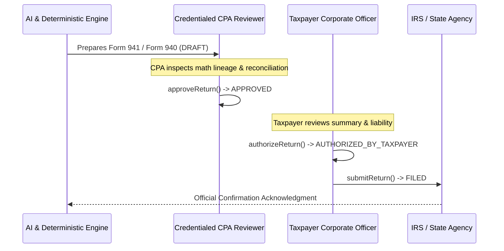

# Autonomous Tax OS — Phase 8: Human Review Workflow & Governance

## 1. The Two-Party Authorization Gate
To guarantee compliance with federal and state regulations and safeguard tenant assets, TaxOS enforces an immutable **Two-Party Authorization Gate** prior to any payroll return transmission or tax payment remittance:

### Invariants:
1. **No Autonomous Submission**: AI agents never transmit returns or initiate fund debits autonomously.
2. **Sequential Approvals**: CPA review must precede Taxpayer officer electronic authorization.
3. **Audit Trail**: Every approval and authorization captures the user ID, timestamp, IP address, and cryptographic signature hash in the tamper-evident audit ledger.

---

## 2. Review Routing & Task Types
Payroll-related tasks are routed strictly by domain and role:
- **`PAYROLL_REVIEWER` / `CPA`**: Required role for review tasks in domain `PAYROLL_TAX`.
- **Review Task Types**:
  - `FORM_941_REVIEW`: Quarterly return verification.
  - `FORM_940_REVIEW`: Annual FUTA return verification.
  - `W2_W3_PARITY_REVIEW`: Annual wage transmittal parity audit.
  - `WORKER_CLASSIFICATION_REVIEW`: Independent contractor risk review.
  - `NOTICE_REVIEW`: Agency penalty/inquiry notices (e.g., IRS CP161, CA EDD).

---

## 3. Agency Notice Defense
When IRS or state employment tax notices are ingested:
1. `PayrollNoticeService.ingestPayrollNotice` extracts the agency, notice type, period, response deadline, and assessed tax/penalties.
2. A high-priority `ReviewTask` (`priority: HIGH`, `qualityReviewRequired: true`) is immediately provisioned.
3. Deadlines are monitored via SLAs to prevent statutory default assessments.
