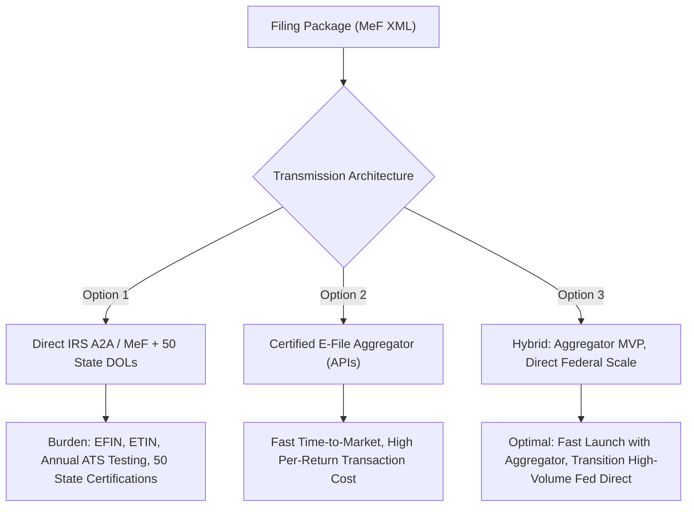

# Phase 9: E-File Provider Strategy & Architecture

## Strategic Evaluation: Direct vs Aggregator vs Hybrid

TaxOS evaluated three architectural models for electronic transmission:

### Comparative Analysis

1. **Direct IRS MeF (Automated Application-to-Application - A2A):**
   - *Requirements:* EFIN, ETIN, Software Developer ID, annual Assurance Testing System (ATS) test suite passes, and individual state agency certifications.
   - *Pros:* Zero per-return intermediary transmission fee; direct control over MeF envelopes and SOAP/WSDL endpoints.
   - *Cons:* Extremely high operational overhead; 50 separate state electronic filing agency specifications.

2. **Certified Third-Party Aggregator:**
   - *Requirements:* Vendor commercial agreement and standard REST API integration.
   - *Pros:* Offloads state-by-state XML dialect variations and agency connection maintenance.
   - *Cons:* Per-filing SaaS toll (\$1.50 - \$8.00 per return); reliance on external uptime during April 15 peak loads.

3. **Hybrid Architecture (Recommended & Implemented):**
   - The TaxOS `TaxFilingProvider` interface abstracts the underlying transport.
   - In development, staging, and private beta, `SandboxFederalFilingProvider` and `SandboxStateFilingProvider` simulate IRS and state transmission with bit-for-bit accurate business rule validations.
   - In production, the adapter can be toggled via environment variables between Direct MeF and Aggregator without changing business logic, readiness gates, or audit pipelines.

---

## Zero False Live Credentials Guarantee

Per strict TaxOS policy:
- The system defaults to `environment: "SANDBOX"`.
- Production credentials (`EFIN`, `ETIN`, state transmitter IDs) are never mocked or fabricated.
- Unless valid production credentials are explicitly injected and validated against live test packs, all submissions operate in safe sandbox mode with explicit UI warning banners.
