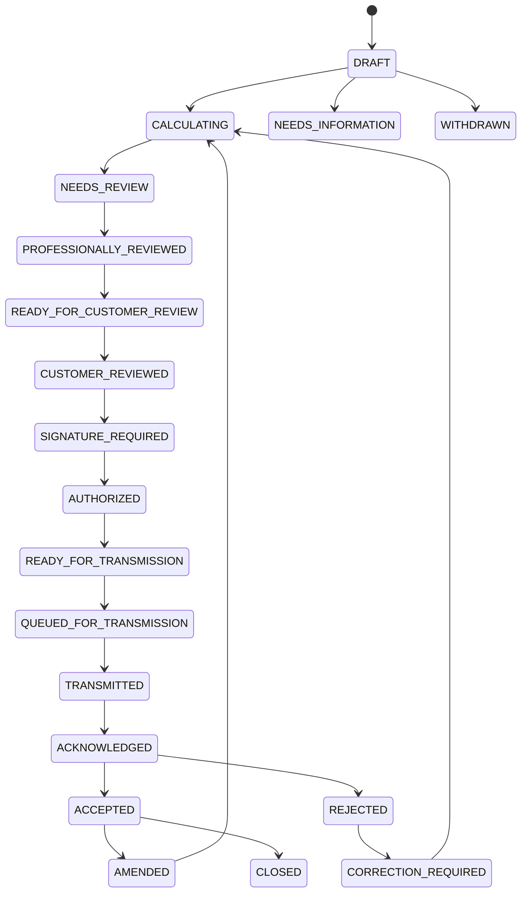

# Phase 9: Filing Readiness Gates & 19-Stage State Machine

## Overview

A fundamental invariant of TaxOS is that **preparing a return is not the same as filing one**. No return may be transmitted to the IRS or state tax authorities simply because a user clicked a button or an AI model completed an inference run.

Transmission is protected behind:
1. **The 8 Mandatory Filing Readiness Gates**
2. **The Rigid 19-Stage Filing State Machine**

---

## The 8 Mandatory Filing Readiness Gates

Implemented in `FilingReadinessService.evaluateFilingReadiness`, every gate must affirmatively return `passed: true` before a return can transition to `READY_FOR_TRANSMISSION`:

| Gate Identifier | Statutory / Operational Invariant | Validation Logic |
| :--- | :--- | :--- |
| `GATE_FACTS_RESOLVED` | All tax facts validated; zero conflicts | Verifies `taxFacts.every(f => f.validationStatus !== 'CONFLICTED')`. |
| `GATE_DOCUMENTS_COMPLETE` | No unprocessed or pending documents | Asserts all case documents are in `COMPLETED` extraction state. |
| `GATE_DETERMINISTIC_CALC_VALID` | Calculation runs completed without errors | Validates latest `TaxCalculationRun` has status `COMPLETED` and zero errors. |
| `GATE_MANDATORY_REVIEWS_COMPLETE` | CPA / EA review sign-off completed | Checks `taxCase.reviewMode === 'HUMAN_VERIFIED'` and no unresolved reviews. |
| `GATE_RULE_VERSIONS_CURRENT` | Engine & rules match current tax year | Verifies `engineVersion` and `ruleSetVersion` match statutory rules for the year. |
| `GATE_NO_BLOCKING_TASKS` | Zero open/blocking ReviewTasks or TaxTasks | Asserts no pending tasks in `OPEN`, `IN_PROGRESS`, or `ESCALATED` status. |
| `GATE_TAXPAYER_REVIEWED_SUMMARY` | Customer reviewed plain-language summary | Confirms `FilingStatus >= CUSTOMER_REVIEWED` or explicit review record. |
| `GATE_AUTHORIZATION_COMPLETE` | Form 8879 / Jurat signed with 5-digit PIN | Validates `returnVersion.isSigned === true` and active `TaxpayerAuthorization`. |

If even a single gate fails, `canTransmit` is `false`, and the response enumerates the exact blocking gate identifiers and resolution remedies.

---

## The 19-Stage Filing State Machine

### Transition Enforcement

`FilingReadinessService.transitionStatus` strictly validates whether `targetStatus` is in `ALLOWED_TRANSITIONS[currentStatus]`. Illegal jumps (e.g., `DRAFT` directly to `TRANSMITTED` or `ACCEPTED`) throw `INVALID_FILING_TRANSITION`. Every valid state transition appends an immutable block to `AuditEvent`.
