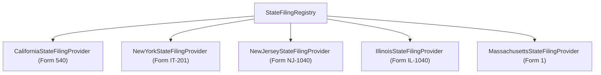

# Phase 9: Multi-State E-File Providers & Isolation

## Overview

State tax electronic filing is not a single unified system. While state e-filing often piggybacks on federal transmission packets (State Linked / Federal-State e-file program), each state department of revenue maintains distinct schemas, validation rules, and agency gateways.

TaxOS implements modular state providers coordinated via `StateFilingRegistry`:
- **California Franchise Tax Board (FTB):** Form 540
- **New York State Department of Taxation and Finance (DTF):** Form IT-201
- **New Jersey Division of Taxation:** Form NJ-1040
- **Illinois Department of Revenue (IDOR):** Form IL-1040
- **Massachusetts Department of Revenue (MassTaxConnect):** Form 1

---

## State Filing Architecture

---

## Per-Obligation Status Isolation

A key architectural requirement in TaxOS is **per-obligation status isolation**. In multi-state or complex filings, each tax jurisdiction operates as an independent obligation with its own filing lifecycle:

| Jurisdiction | Agency | Status | State Machine State |
| :--- | :--- | :--- | :--- |
| **Federal** | IRS | `ACCEPTED` | `ACCEPTED` |
| **California** | FTB | `ACCEPTED` | `ACCEPTED` |
| **New York** | NY DTF | `REJECTED` | `REJECTED` / `CORRECTION_REQUIRED` |

A rejection by New York State (e.g., missing school district code or IT-2104-E mismatch) does **not** corrupt or alter the accepted federal return or California return. The New York obligation transitions to `CORRECTION_REQUIRED` while the federal and California obligations remain permanently `ACCEPTED`.
