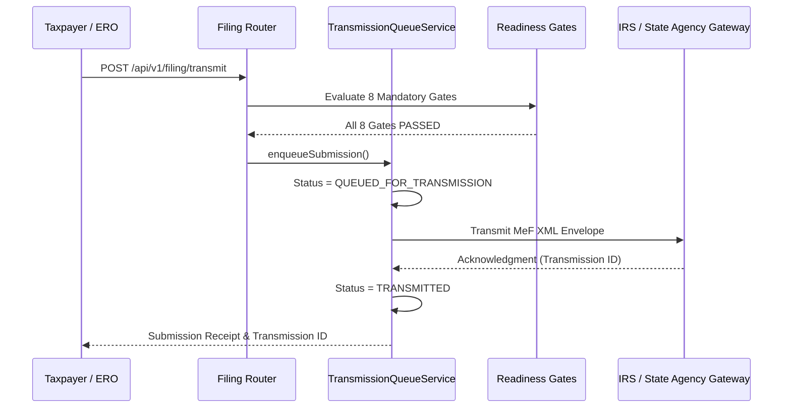

# Phase 9: Submission Queue, Idempotency & Acknowledgment Architecture

## Overview

Submitting a return to the IRS or state tax authorities involves distributed asynchronous messaging. Network timeouts, server resets, and webhook retries must never cause duplicate return transmissions. Inadvertently double-filing a tax return triggers catastrophic IRS Master File duplicate filing rejections (`R0000-902-01`).

TaxOS solves this via:
1. **Durable Transmission Queue (`TransmissionQueueService`)**
2. **Deterministic Idempotency Keys**
3. **Acknowledgment Ingestion**

---

## Deterministic Idempotency Key Generation

The idempotency key for any filing submission is computed deterministically from the immutable attributes of the return:

$$\text{IdempotencyKey} = \text{SHA-256}\Big(\text{taxCaseId} \mid \text{jurisdiction} \mid \text{taxYear} \mid \text{versionNumber} \mid \text{returnVersionHash}\Big)$$

```typescript
public static generateIdempotencyKey(params: {
  taxCaseId: string;
  jurisdiction: string;
  taxYear: number;
  versionNumber: number;
  snapshotHash: string;
}): string {
  return crypto.createHash('sha256')
    .update(`${params.taxCaseId}:${params.jurisdiction}:${params.taxYear}:v${params.versionNumber}:${params.snapshotHash}`)
    .digest('hex');
}
```

If a client retries submission or a network socket disconnects, the database uniquely enforces `@@unique([idempotencyKey])` on `FilingSubmission`. The existing submission is returned without transmitting an additional payload.

---

## Transmission Queue Lifecycle



---

## Asynchronous Acknowledgment Polling & Webhooks

Transmission status updates arrive asynchronously via IRS A2A SOAP GetAck response or aggregator webhooks. Upon receipt:
1. `FilingAcknowledgment` record is persisted with raw agency response, agency timestamp, and confirmation number.
2. If `ACCEPTED`:
   - `FilingSubmission.status` $\rightarrow$ `ACCEPTED`
   - `ReturnVersion.filingStatus` $\rightarrow$ `ACCEPTED`
   - Associated `TaxObligation.status` $\rightarrow$ `COMPLETED`
3. If `REJECTED`:
   - Automatically dispatched to `RejectionEngine`.
