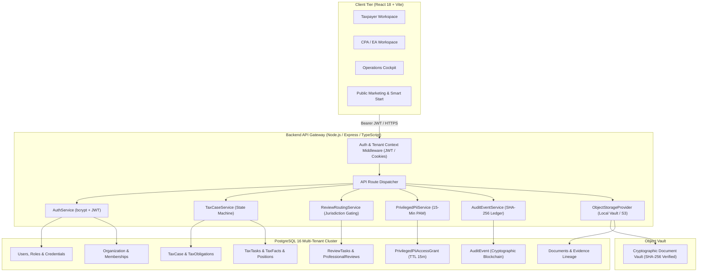

# Autonomous TaxOS — Phase 1 Platform Architecture

**Status:** APPROVED & DEPLOYED (Alpha Foundation)  
**Database:** PostgreSQL 16.15 on Docker (`127.0.0.1:54321`)  
**ORM / Migration Engine:** Prisma ORM 6.19.3  
**Target Environments:** `taxos_dev` & `taxos_test`  
**Security Boundary:** Multi-Tenant Row Isolation, PAM PII 15-Min Expiry, SHA-256 Audit Blockchain  

---

## 1. Executive Summary

Phase 1 transitions TaxOS from a client-side prototype with transient in-memory state into a hardened, production-grade **Alpha Platform Foundation**. In previous iterations, state lived in ephemeral JavaScript variables (`let activeTaxCase`, `let tasksQueue`, `let documentVault`). Under Phase 1:

1. **Persistent Relational Database:** All domain state is persisted in PostgreSQL 16 using Prisma ORM with strict referential integrity, foreign key cascading, and database-level unique constraints.
2. **Multi-Tenant Row Isolation:** Tenant data (`Organization`) is strictly bounded. Users cannot query, mutate, or observe entities belonging to foreign organizations.
3. **Canonical TaxCase Aggregate:** `TaxCase` is an ACID-compliant database entity supporting individual and multi-domain businesses (Federal 1040, California 540, California CDTFA Sales Tax, Federal 941 Payroll Tax). Review mode (`AI_AUTOPILOT`, `HUMAN_VERIFIED`, `FULL_SERVICE`) is permanently persisted.
4. **Professional Routing System:** CPA, EA, and Attorney reviewers are gated by verified credentials (PTIN, State Bar/Board licenses), authorized tax jurisdictions (`US-FED`, `US-CA`, `US-NY`), authorized domains (`INCOME_TAX`, `SALES_TAX`, `PAYROLL_TAX`), and active capacity limits.
5. **Privileged Access Management (PAM) for PII:** Sensitive PII (SSN, FEIN) is masked by default (`***-**-6789`). Unmasking requires formal re-authentication, documented purpose, authorized reviewer role, and automatically expires after exactly 15 minutes.
6. **Cryptographic SHA-256 Audit Trail:** Every state mutation is immutably appended to a sequential blockchain ledger (`previousBlockHash` -> `blockHash`) with tamper detection algorithms.

---

## 2. Platform Architecture Diagram

---

## 3. Core Subsystems

### 3.1 Persistence & Data Layer
- **Engine:** PostgreSQL 16 Alpine running in an isolated Docker container bound to `127.0.0.1:54321`.
- **Client:** `@prisma/client` 6.19.3 with TypeScript type generation.
- **Migration & Schema Enforcement:** Declarative `prisma/schema.prisma` with 28 models, 13 enums, composite indexes, and strict foreign keys.
- **Connection Pooling:** Prisma client singleton pattern (`src/server/db.ts`) preventing socket exhaustion.

### 3.2 Identity & Multi-Tenancy
- **Tenancy Boundary:** `Organization` model (`id`, `name`, `slug`, `tier`, `settings`).
- **User Identity:** Single user account (`User`) can hold memberships across multiple organizations via `OrganizationMembership`.
- **Authentication:** Passwords salted and hashed with `bcryptjs` (cost factor 10). JWT tokens carry `userId`, `role`, and `organizationId`.
- **Tenant Isolation Enforcement:** All queries filter on `organizationId`. Tenant A attempting to query Tenant B's case receives an explicit `CASE_NOT_FOUND_OR_ACCESS_DENIED` rejection.

### 3.3 Canonical TaxCase Aggregate
- **Entity Model:** `TaxCase` anchors all tax-related operations for an annual tax cycle.
- **Rollup Fields:** High-level rollups stored in integer cents (`BigInt`) to prevent IEEE 754 floating-point inaccuracies (`grossIncomeCents`, `deductionsCents`, `taxableIncomeCents`, `federalRefundOrDueCents`, `stateDueCents`).
- **Review Mode Persistence:** `ReviewMode` (`AI_AUTOPILOT`, `HUMAN_VERIFIED`, `FULL_SERVICE`) is stored in the database.
- **Lifecycle State Machine:** Formal transitions enforced by `VALID_CASE_TRANSITIONS`:
  `DRAFT` -> `DOCUMENT_INTAKE` -> `NEEDS_YOU` -> `READY_FOR_REVIEW` -> `IN_REVIEW` -> `APPROVED` -> `FILED` -> `TRANSMITTED` -> `ACCEPTED`.

### 3.4 Multi-Domain Tax Obligations
`TaxObligation` extends TaxOS beyond personal Form 1040 returns:
1. **Federal Income Tax:** `US-FED` (Form 1040 / Schedule C), annual cycle.
2. **State Income Tax:** `US-CA` (Form 540 / Schedule CA), annual cycle with California non-conformity adjustments.
3. **Sales & Use Tax:** `CA-CDTFA` (Form CDTFA-401), quarterly obligation.
4. **Payroll & Employment Tax:** `US-FED` (Form 941), quarterly withholding & FICA obligation.

### 3.5 Professional Review & Jurisdiction Routing
- **Jurisdiction-Gated Assignment:** A CPA or EA can only view and claim `ReviewTask` records for jurisdictions in their `authorizedJurisdictions` profile array. A California CPA (`US-FED`, `US-CA`) cannot claim a New York task (`US-NY`).
- **Domain Authorization:** Tax specialists are restricted to their authorized domains (`INCOME_TAX`, `SALES_TAX`, `PAYROLL_TAX`).
- **Workload Capacity:** System enforces `currentActiveCases < maxActiveCaseCapacity`.
- **PTIN Sign-off:** Sign-offs require a valid PTIN and generate a permanent `ProfessionalReview` record with a SHA-256 seal.

### 3.6 Privileged Access Management (PAM) for PII
- **Default Masking:** Taxpayer SSNs are masked as `***-**-6789`.
- **Elevation Workflow:** Staff must supply their password, an audit reason (minimum 10 characters), and hold an authorized role (`CPA`, `EA`, `ATTORNEY`, `OPERATIONS_MANAGER`, `SUPER_ADMIN`).
- **15-Minute Expiration:** Grants expire automatically after 900 seconds (`expiresAt = grantedAt + 15m`).
- **Audit Logging:** Every grant issue and manual revocation is immutably logged.

### 3.7 Cryptographic Audit Trail
- **Chain Architecture:** Sequential blockchain where each block computes:
  `blockHash = SHA-256(sequence | previousBlockHash | actorId | actorRole | action | objectType | objectId | canonicalJson(prev) | canonicalJson(new) | reason | timestamp)`
- **Genesis Block:** Sequence 1 anchors to `0000000000000000000000000000000000000000000000000000000000000000`.
- **Tamper Detection:** `AuditEventService.verifyChainIntegrity` iterates through all sequential blocks, recomputes hashes using canonical sorted JSON, and flags any altered payloads with the exact violated sequence number.

---

## 4. Verification & Testing

The Phase 1 platform foundation was verified using an end-to-end automated test suite (`src/tests/phase1_verification.ts`):

| Test Suite | Purpose | Status |
|:---|:---|:---:|
| 1. Schema & Seed Integrity | Verifies 28 models, 8 jurisdictions, tenants, users, and multi-domain obligations | **PASSED** |
| 2. Multi-Tenant Isolation | Confirms Tenant A cannot read or mutate Tenant B records | **PASSED** |
| 3. RBAC Enforcement | Confirms Taxpayer cannot access professional review queues or request PAM PII | **PASSED** |
| 4. Professional Routing | Confirms CA CPA cannot claim NY review task; validates PTIN signoff | **PASSED** |
| 5. PAM PII 15-Min Expiration | Confirms masked SSN, re-auth grant issuance, unmasking, and expiration | **PASSED** |
| 6. State Machine Transitions | Validates legal status transitions and rejects illegal skips | **PASSED** |
| 7. Cryptographic Audit Trail | Proves tamper detection when historical database record is mutated | **PASSED** |
| 8. Object Storage Vault | Proves SHA-256 integrity check and byte equality on read | **PASSED** |

**Summary:** 8 / 8 Tests Passed (100% Success Rate).
