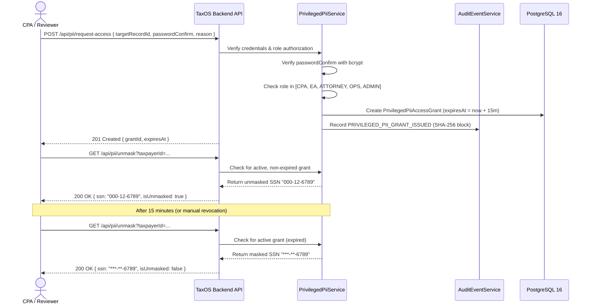

# Autonomous TaxOS — RBAC / ABAC Security & Privileged Access Management (PAM)

**Status:** IMPLEMENTED & TEST VERIFIED  
**Authorization Model:** Hybrid RBAC (Roles) + ABAC (Jurisdictions & Domains) + PAM (Time-Bounded Elevation)  
**Sensitive Data Protection:** AES-256 Tokenized Storage, Default Masked Presentation, 15-Minute PAM Unmasking  
**IRC § 7216 & Circular 230 Compliant:** Yes  

---

## 1. Security Architecture Overview

TaxOS implements defense-in-depth access control combining three tiers of authorization:

1. **Role-Based Access Control (RBAC):** Coarse-grained functional boundaries distinguishing taxpayers, tax professionals, managers, and system administrators.
2. **Attribute-Based Access Control (ABAC):** Fine-grained jurisdiction, domain, and licensing constraints governing professional review assignment.
3. **Privileged Access Management (PAM):** Strict time-limited credential elevation protecting sensitive Personally Identifiable Information (SSN, FEIN).

---

## 2. Platform Role Taxonomy (RBAC)

The `UserRole` enum codifies 21 distinct platform operational roles:

| Category | Roles | Permissions & Capabilities |
|:---|:---|:---|
| **Taxpayers & Clients** | `TAXPAYER`, `BUSINESS_OWNER`, `CFO` | Access own organization's TaxCase, upload documents via TaxDrop, answer Needs-You questions, review draft calculations, authorize Form 8879 e-file. |
| **Professional Preparers** | `PAID_PREPARER`, `CTEC_PREPARER`, `STAFF_PREPARER` | Prepare draft schedules, reconcile bank feeds, propose tax positions. Cannot issue final sign-off. |
| **Licensed Reviewers** | `CPA`, `EA`, `ATTORNEY`, `SENIOR_REVIEWER` | Review tax positions, evaluate tax risks, issue statutory overrides, sign returns with PTIN/Bar credentials. |
| **Domain Specialists** | `FEDERAL_REVIEWER`, `STATE_REVIEWER`, `SALES_TAX_REVIEWER`, `PAYROLL_REVIEWER`, `BUSINESS_TAX_REVIEWER` | Specialized review rights restricted to specific tax schedules and filing regimes. |
| **Operations & Care** | `OPERATIONS_MANAGER`, `CASE_MANAGER`, `CUSTOMER_SUPPORT` | Queue routing, case triage, capacity balancing, communication management. No direct statutory sign-off. |
| **Governance & Admin** | `FIRM_ADMIN`, `ORG_ADMIN`, `TAX_KNOWLEDGE_ADMIN`, `SECURITY_ADMIN`, `SUPER_ADMIN` | Organization configuration, user lifecycle, kill switches, rule release management, audit verification. |

---

## 3. Professional Review Routing & ABAC Model

Possessing the role `CPA` or `EA` is necessary but **not sufficient** to claim a review task. Under ABAC, access is governed by the attributes on `ProfessionalProfile`:

```prisma
model ProfessionalProfile {
  credentialType          CredentialType
  credentialNumber        String
  credentialStatus        CredentialStatus   // Must be ACTIVE
  ptin                    String?            // Required for return signoff
  authorizedJurisdictions String[]           // e.g. ["US-FED", "US-CA"]
  authorizedTaxDomains    String[]           // e.g. ["INCOME_TAX", "SALES_TAX"]
  maxActiveCaseCapacity   Int                // Default 25
  currentActiveCases      Int                // Real-time workload
}
```

### 3.1 Gated Authorization Rules
When a reviewer attempts to claim or review a `ReviewTask`:
1. **Active License Check:** `credentialStatus === ACTIVE`. Suspended or expired credentials reject immediately.
2. **Jurisdiction Authorization Check:** `professional.authorizedJurisdictions.includes(task.jurisdiction)`. A CPA licensed exclusively in California cannot claim a New York Form IT-201 allocation review.
3. **Tax Domain Authorization Check:** `professional.authorizedTaxDomains.includes(task.taxDomain)`. An individual income specialist cannot claim a sales tax nexus audit workpaper.
4. **Capacity Check:** `currentActiveCases < maxActiveCaseCapacity`. Prevents reviewer fatigue and unreviewed queue bottlenecks.

---

## 4. Privileged Access Management (PAM) for Sensitive PII

Under IRS regulations and FTC Safeguards, staff members must not possess persistent, unrestricted plaintext visibility into taxpayer Social Security Numbers (SSNs) or Federal Employer Identification Numbers (FEINs).

### 4.1 Masked by Default
In all standard views, API responses, and logs:
- SSN displays as: `***-**-6789`
- FEIN displays as: `**-***8492`

### 4.2 The 15-Minute Unmasking Protocol
When a CPA or EA requires unmasked access (e.g., verifying a Form W-2 Box a SSN match against an IRS reject notice):



### 4.3 Mandatory PAM Enforcement Rules
1. **Re-Authentication Required:** Even with an active JWT session, the actor must supply their password or WebAuthn factor to confirm identity at the moment of request.
2. **Documented Purpose:** A descriptive justification of at least 10 characters is mandatory (e.g., `"Audit verification of Form W-2 Box a SSN conformity"`).
3. **Immutable Logging:** Grant issuance, duration, target record, and reason are committed to the cryptographic audit blockchain.
4. **Strict Ephemerality:** Exactly 900 seconds (15 minutes) after creation, database queries evaluating `expiresAt > now()` return false, automatically reverting all presentations to masked without requiring manual batch sweeps.

---

## 5. Security Test Verification Results

All RBAC, ABAC, and PAM controls were empirically tested and passed in `src/tests/phase1_verification.ts`:
- **Test 3 (RBAC):** Taxpayer denied access to professional queues (`INACTIVE_OR_UNAUTHORIZED_PROFESSIONAL_PROFILE`) and denied PAM PII elevation (`UNAUTHORIZED_ROLE_FOR_PII_ACCESS`).
- **Test 4 (ABAC):** California CPA claimed CA task; denied NY task (`UNAUTHORIZED_JURISDICTION`); EA claimed NY task; CPA sign-off validated with PTIN and sealed with SHA-256 hash.
- **Test 5 (PAM):** Masked by default; bad password rejected (`INVALID_REAUTHENTICATION_CREDENTIALS`); valid request issued 15-minute grant; SSN revealed; manual revocation immediately re-masked.
