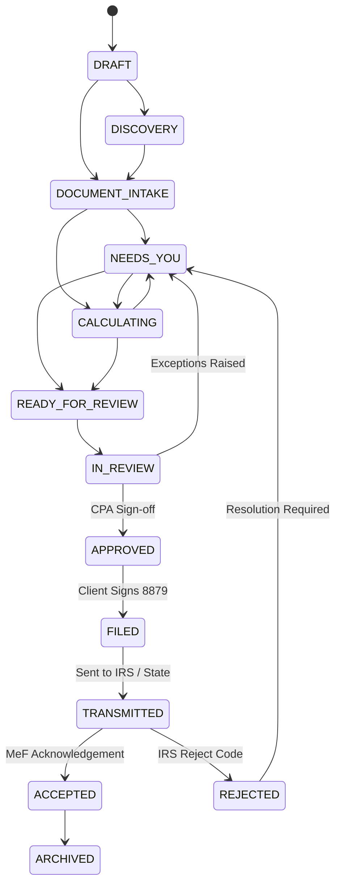

# Autonomous TaxOS — Canonical TaxCase Aggregate Specification

**Status:** IMPLEMENTED & ACID-COMPLIANT  
**Pattern:** Domain-Driven Design (DDD) Canonical Aggregate Root  
**Primary Entity:** `TaxCase`  
**State Machine:** Bounded Deterministic Lifecycle  
**Monetary Representation:** 64-Bit Integer Cents (`BigInt`)  

---

## 1. Aggregate Boundary & DDD Architecture

In tax compliance systems, fragmented data structures (e.g. storing deductions in disconnected tables without strict lifecycle ties to a filing year) create reconciliation drift, ghost calculations, and unverified filings.

TaxOS treats `TaxCase` as the **Canonical Aggregate Root**. All child entities related to a filing year exist within this aggregate boundary and maintain foreign keys with explicit referential integrity rules.

```
TaxCase (Aggregate Root)
   ├── TaxObligation[] (Federal Income, CA State Income, CDTFA Sales Tax, Form 941 Payroll)
   ├── TaxTask[] (Needs You canonical questions & confirmations)
   ├── TaxFact[] (Extracted W-2 wages, 1099 nonemployee compensation, expense ledgers)
   ├── TaxPosition[] (Statutory positions: § 162 ordinary expenses, § 199A QBI)
   ├── TaxDecision[] (Deterministic AI consensus vs CPA overrides)
   ├── TaxCalculation[] (Deterministic calculation engine snapshots)
   ├── ReviewTask[] (Jurisdiction-gated work orders for CPAs/EAs)
   ├── ProfessionalReview[] (PTIN-signed cryptographic review workpapers)
   ├── TaxFiling[] (IRS MeF and state electronic transmission records)
   ├── Document[] (Source documents in object vault)
   └── Evidence[] (Lineage links binding facts/positions to documents)
```

---

## 2. Multi-Domain Tax Obligation Architecture

TaxOS natively supports multi-domain business entities. Rather than treating an S-Corp or LLC return as a Form 1040 variant, `TaxCase` coordinates multiple concurrent `TaxObligation` entities:

| Obligation ID | Domain | Jurisdiction | Filing Form | Period | Due Date | Status |
|:---|:---|:---|:---|:---|:---|:---|
| `ob-inc-2026-fed` | `INCOME_TAX` | `US-FED` (IRS) | Form 1040 / Sched C / 1120-S | `2026-ANNUAL` | 2027-04-15 | `CALCULATED` |
| `ob-inc-2026-ca` | `INCOME_TAX` | `US-CA` (FTB) | Form 540 / Sched CA | `2026-ANNUAL` | 2027-04-15 | `CALCULATED` |
| `ob-sales-2026-q1-cdtfa` | `SALES_TAX` | `CA-CDTFA` | CDTFA-401 | `2026-Q1` | 2026-04-30 | `IN_PROGRESS` |
| `ob-pay-2026-q1-fed` | `PAYROLL_TAX` | `US-FED` (IRS) | Form 941 | `2026-Q1` | 2026-04-30 | `IN_PROGRESS` |

Each obligation tracks its own independent `ruleSetVersion` (e.g. `2026.1-IRC`, `2026.1-FTB`), `reviewStatus`, and `filingStatus` while rolling up financial summaries to the root `TaxCase`.

---

## 3. Review Mode Persistence

In previous prototypes, review mode was transient UI state stored in client-side React variables. In Phase 1, `ReviewMode` is a first-class column in PostgreSQL:

```prisma
enum ReviewMode {
  AI_AUTOPILOT
  HUMAN_VERIFIED
  FULL_SERVICE
}
```

- **`AI_AUTOPILOT`:** Automated agent consensus runs calculation and validation. Flags only high-risk anomalies to the taxpayer.
- **`HUMAN_VERIFIED`:** Default hybrid tier. Autonomous agents perform extraction, calculation, and cross-checking; a licensed CPA or EA reviews the final package, checks exceptions, and formally signs off with their PTIN.
- **`FULL_SERVICE`:** White-glove dedicated CPA engagement. A dedicated practitioner oversees document collection, strategy workpapers, and controversy defense.

Updates to review mode persist to the database and append an immutable `AuditEvent` (`UPDATE_REVIEW_MODE`).

---

## 4. Formal Lifecycle State Machine

A `TaxCase` progresses through a strictly defined state machine. Transitions that violate regulatory filing sequence are rejected by the API:



### 4.1 State Machine Enforcement Matrix
```typescript
export const VALID_CASE_TRANSITIONS: Record<CaseStatus, CaseStatus[]> = {
  [CaseStatus.DRAFT]: [CaseStatus.DISCOVERY, CaseStatus.DOCUMENT_INTAKE],
  [CaseStatus.DISCOVERY]: [CaseStatus.DOCUMENT_INTAKE],
  [CaseStatus.DOCUMENT_INTAKE]: [CaseStatus.NEEDS_YOU, CaseStatus.CALCULATING],
  [CaseStatus.NEEDS_YOU]: [CaseStatus.CALCULATING, CaseStatus.READY_FOR_REVIEW],
  [CaseStatus.CALCULATING]: [CaseStatus.NEEDS_YOU, CaseStatus.READY_FOR_REVIEW],
  [CaseStatus.READY_FOR_REVIEW]: [CaseStatus.IN_REVIEW],
  [CaseStatus.IN_REVIEW]: [CaseStatus.NEEDS_YOU, CaseStatus.APPROVED],
  [CaseStatus.APPROVED]: [CaseStatus.FILED],
  [CaseStatus.FILED]: [CaseStatus.TRANSMITTED],
  [CaseStatus.TRANSMITTED]: [CaseStatus.ACCEPTED, CaseStatus.REJECTED],
  [CaseStatus.ACCEPTED]: [CaseStatus.ARCHIVED],
  [CaseStatus.REJECTED]: [CaseStatus.NEEDS_YOU, CaseStatus.CALCULATING],
  [CaseStatus.ARCHIVED]: [],
};
```

If a client attempts an illegal skip (e.g. `DOCUMENT_INTAKE` directly to `TRANSMITTED`), `TaxCaseService.transitionStatus` aborts and throws `ILLEGAL_CASE_TRANSITION`. This was empirically verified in Test #6.

---

## 5. Integer Cents Precision Model

To eliminate cumulative floating-point rounding errors that can cause $1 discrepancies across Schedule C, Schedule SE, and Form 1040 line items, all calculations use integer cents:

$$\text{grossIncomeCents} = 14820000\text{n} \iff \$148,200.00$$
$$\text{deductionsCents} = 3044000\text{n} \iff \$30,440.00$$
$$\text{taxableIncomeCents} = 12165000\text{n} \iff \$121,650.00$$
$$\text{federalRefundOrDueCents} = 412000\text{n} \iff +\$4,120.00$$
$$\text{stateDueCents} = 184000\text{n} \iff -\$1,840.00$$

All database schema definitions, API payloads, and calculation engine interfaces strictly honor this representation.
