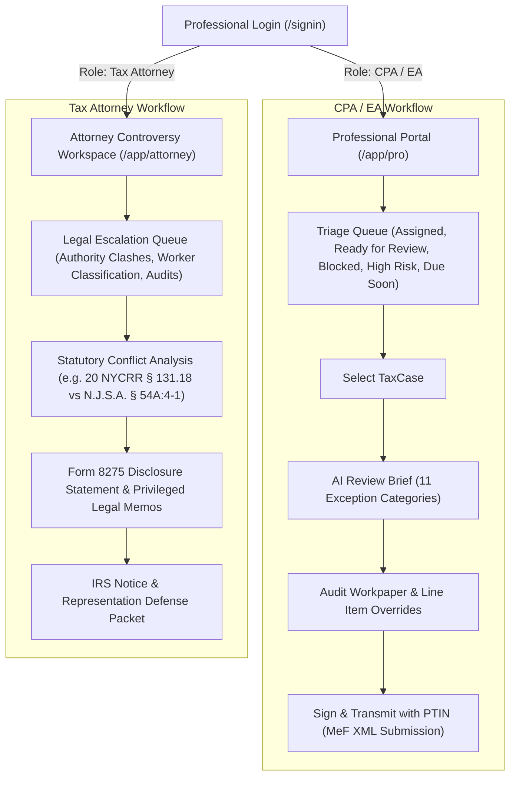

# TaxOS — Professional & Legal Workspaces Flow Specification

> **Document Status**: Production Product Standard  
> **Target Roles**: CPAs, Enrolled Agents (EAs), Tax Preparers, Tax Controversy Attorneys  

---

## 1. Professional Operating Philosophy: Exception-Based Review

Traditional accounting software forces professionals to manually re-enter or re-verify every W-2 box and bank receipt. 

In Autonomous Tax OS, **the AI prepares the workpaper baseline, and the professional reviews only the exceptions**. A CPA or EA should be able to review and approve a complete return in under 8 minutes with 100% calculation provenance.

---

## 2. Professional Case Triage Queue

The professional workspace features a filtered, priority-sorted case ledger:

* **Queue Filters**:
  * 🟢 **Ready for Review** (Taxpayer has answered all Needs You items; ready for sign-off)
  * 🟡 **Waiting on Client** (Unresolved Needs You inquiries pending taxpayer action)
  * 🔴 **Blocked / Anomaly Flagged** (AI disagreement or cross-document contradiction detected)
  * ⚠️ **High Risk** (Unusual deduction thresholds or statutory classification conflicts)
  * ⏰ **Due Soon** (Statutory filing deadline within 14 calendar days)
  * 📁 **Filed / Accepted** (Successfully transmitted and accepted by IRS MeF / State DOR)
  * ❌ **Rejected / Action Required** (Agency business rule rejection needing amendment)

---

## 3. The CPA / EA AI Review Brief

Upon opening a case, the CPA or EA receives a prioritized, 11-section review summary:

1. **Income Reconciliation**: Summary of W-2, 1099, and processor deposits with verified triangulation variance ($0.00).
2. **Deductions Summary**: Schedule C ordinary and necessary expenses (IRC § 162) broken down by category.
3. **Tax Credits**: Verification of child tax credits, energy credits, and QBI 20% calculations (IRC § 199A).
4. **Federal Lines**: Critical Form 1040 checkpoints (Lines 1z, 9, 15, 24, 34/37).
5. **State Return Modifications**: State additions/subtractions (e.g., California HSA addition under Cal. RTC § 17215.4; NY convenience sourcing).
6. **Evidence Health**: Audit of document hashes, receipt coverage percentage, and bank ledger cross-references.
7. **Contradictions Checked**: Report verifying no conflicting documents or duplicate 1099 statements exist.
8. **AI Disagreements & Adversarial Checks**: Flags where the IRS Challenger agent contested a deduction and human policy intervention was required.
9. **Questions Answered by Taxpayer**: Full audit log of every question answered in the Needs You queue with timestamps.
10. **Potential Missed Opportunities**: Tax planning deductions identified but not yet claimed due to missing taxpayer documentation.
11. **Risk Score & Audit Probability**: Quantitative audit risk score based on IRS DIF (Discriminant Information Function) patterns.

### Professional Actions:
* **Approve**: Confirms calculations and locks workpapers.
* **Adjust / Override**: Allows preparer to enter a revised dollar figure and record mandatory CPA justification in the audit workpaper.
* **Request Information**: Dispatches a new focused inquiry card directly to the taxpayer’s Needs You queue.
* **Escalate to Legal**: Transmits the case directly to the Tax Attorney workspace for formal legal opinion or Form 8275 disclosure.
* **Sign Off (PTIN)**: Electronically signs the return using Preparer Tax Identification Number (PTIN) and authorizes MeF XML generation.

---

## 4. Tax Attorney Controversy Workspace

Reserved exclusively for licensed tax attorneys and legal counsel handling complex statutory conflicts:

### Escalate Legal Triggers:
* **Multi-State Convenience of Employer Clashes** (e.g., New York claiming 100% withholding under 20 NYCRR § 131.18 vs. New Jersey retaliatory credits under N.J.S.A. § 54A:4-1).
* **Worker Classification Controversy** (Defending independent contractor status under California AB 5 / ABC Test vs. common law standards).
* **IRS CP2000 / Examination Notices** (Automated notice parsing, discrepancy tracing, and response drafting).
* **Penalty Abatement & Form 8275 Disclosures** (Generating Section 6662 accuracy-related penalty defenses with primary statutory citations).

### Attorney Workpaper Shield:
All files, memos, and client communications within this workspace are tagged with **Attorney-Client Privilege** metadata and encrypted with dedicated legal KMS keys.
