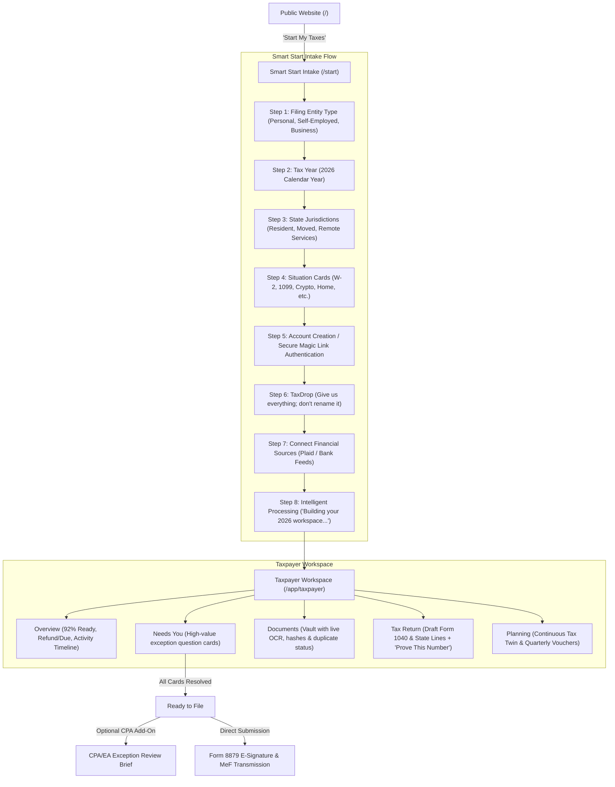

# TaxOS — Taxpayer End-to-End Operating Flow Specification

> **Document Status**: Production Product Standard  
> **Target Experience**: B2C Consumers, Freelancers, Contractors, Solo Founders  

---

## 1. Flow Diagram: Intake to E-Filing

---

## 2. Smart Start Intake Experience (`/start`)

### Step 1: Who are you filing for?
* **Options**: Personal (Individual / Family), Self-Employed (Freelancer / Contractor / Solo LLC), Business (S-Corp, Partnership, Multi-Member LLC), Tax Professional (Filing for clients).
* **Selection Behavior**: Selectable card with immediate visual feedback and subtext explaining tailored deduction extractors.

### Step 2: Tax Year
* **Anchor**: Calendar Year 2026 (with option to select prior year delinquent/amended filings).

### Step 3: State Jurisdictions
* **Interactive State Selector**:
  * Resident State (Primary domicile).
  * Checkbox: *“I moved between states during 2026”* $\rightarrow$ Expands part-year residency dates.
  * Checkbox: *“I earned income or performed services in another state”* $\rightarrow$ Multi-state non-resident nexus detection.

### Step 4: Situation Cards (Progressive Taxonomy)
A grid of clean, interactive toggle cards:
* 💼 **W-2 Employment** (Full-time or part-time job)
* 🛠️ **1099-NEC / Freelancing** (Consulting, independent contractor)
* 📱 **Creator / 1099-K** (Stripe, YouTube, Substack, Etsy)
* 📈 **Stock & Investments** (Brokerage accounts, dividends, capital gains)
* 🪙 **Cryptocurrency / Web3** (Coinbase, Ethereum, digital asset trades)
* 🏠 **Home Ownership / Rent** (Mortgage interest, property taxes, home office)
* 👨‍👩‍👧 **Dependents & Family** (Children, daycare expenses, college tuition)
* 🎓 **Education** (Student loan interest, 1098-T tuition credits)
* 🏖️ **Retirement** (IRA contributions, 401k rollovers, pension distributions)
* 🏢 **Rental Property** (Real estate income and depreciation)
* 🏷️ **Other / Special Situation** (HSA accounts, foreign accounts, energy credits)

### Step 5: Seamless Authentication
* Email + Passwordless Magic Link / WebAuthn Passkey. Account is created and cryptographically bound to the intake session state.

### Step 6: TaxDrop™ — "Give us everything."
* **Guiding Philosophy**:
  > *"Give us everything. Don't organize it. Don't rename it."*
* **Supported Formats**: PDF, JPG, PNG, CSV, XLSX, ZIP bundles up to 100MB.
* **Instant Processing Pipeline**: Displays real-time stages for each ingested file:
  * Upload $\rightarrow$ Virus Scan $\rightarrow$ Multimodal OCR $\rightarrow$ Document Classification $\rightarrow$ Cryptographic SHA-256 Hashing $\rightarrow$ Transaction Matching $\rightarrow$ Duplicate Elimination.

### Step 7: Connect Financial Accounts (OAuth)
* Direct connection via Plaid / Stripe to auto-classify deductible expenses and cross-reconcile bank receipts with processor revenues.

### Step 8: The Live TaxCase Build Screen
* Animated live progress derived from actual system state:
  * 🟢 *Understanding your documents (37 verified)...*
  * 🟢 *Matching bank accounts and processor feeds...*
  * 🟢 *Reconstructing gross income ($148,200 verified)...*
  * 🟢 *Checking for duplicates (1 duplicate Stripe statement eliminated)...*
  * 🟢 *Finding tax deductions ($18,490 business expenses matched)...*
  * 🟢 *Building Federal Form 1040 return...*
  * 🟢 *Building California Form 540 state return...*
* **Transition**: Seamlessly routes into the Taxpayer Workspace.

---

## 3. Taxpayer Workspace Architecture

### 3.1 Overview Tab
Answers the five fundamental taxpayer questions within 5 seconds:
1. **How complete are my taxes?** $\rightarrow$ Prominent progress meter: *"Your 2026 Taxes are 92% Ready"*.
2. **Refund or amount due?** $\rightarrow$ High-contrast figures: Federal Refund (`+$4,120`) and State Balance Due (`-$1,840`).
3. **What does TaxOS need from me?** $\rightarrow$ Prominent badge: *"3 quick items need your confirmation before e-filing"*.
4. **What has TaxOS already completed?** $\rightarrow$ Timeline showing 37 receipts matched, gross income reconciled, QBI 20% deduction computed.
5. **What happens next?** $\rightarrow$ Clear next-action button: *“Review Needs You (3 Items)”*.

### 3.2 Needs You Tab (The Non-Questionnaire)
Replaces the 80-question interview wizard with single-purpose, high-leverage cards.
* **Card Anatomy**:
  * **What TaxOS Found**: e.g., *"Delta Air Lines ticket to San Francisco ($412.50) on Nov 14."*
  * **Why It Matters**: *"Connected to your client contract with Stripe; potentially deductible under 26 U.S.C. § 162."*
  * **Potential Impact**: *"+$142 to your Federal Refund."*
  * **Evidence**: Matched card receipt linked to Chase Business checking debit.
  * **Minimum Question**: *"Was this flight exclusively for business purposes?"*
  * **Response Options**: `[✓ Yes, 100% Business Travel]` `[Personal Travel (Disallow)]` `[Mixed Purpose]`.

### 3.3 Documents Tab
Interactive file ledger showing every document, extracted tax facts, matched transactions, confidence score, and download link.

### 3.4 Tax Return Tab & "Prove This Number"
* Clean visual rendering of Form 1040 and State schedules.
* Every material number is clickable to launch the **"Prove This Number"** drawer:
  * **Consumer View**: Plain English summary explaining where the number came from and how it saves money.
  * **Lineage Chain**: Form Line $\rightarrow$ Deterministic Formula $\rightarrow$ Reconciled Transactions $\rightarrow$ Source Document Hashes $\rightarrow$ User Confirmation.
  * **Statutory Accordion**: Collapsible legal foundation with primary code citation (e.g., `26 U.S.C. § 199A`).

### 3.5 Planning Tab
* **Tax Twin**: Continuous scenario simulator to evaluate estimated quarterly payments, retirement contributions, and Section 179 equipment purchases before year-end.
