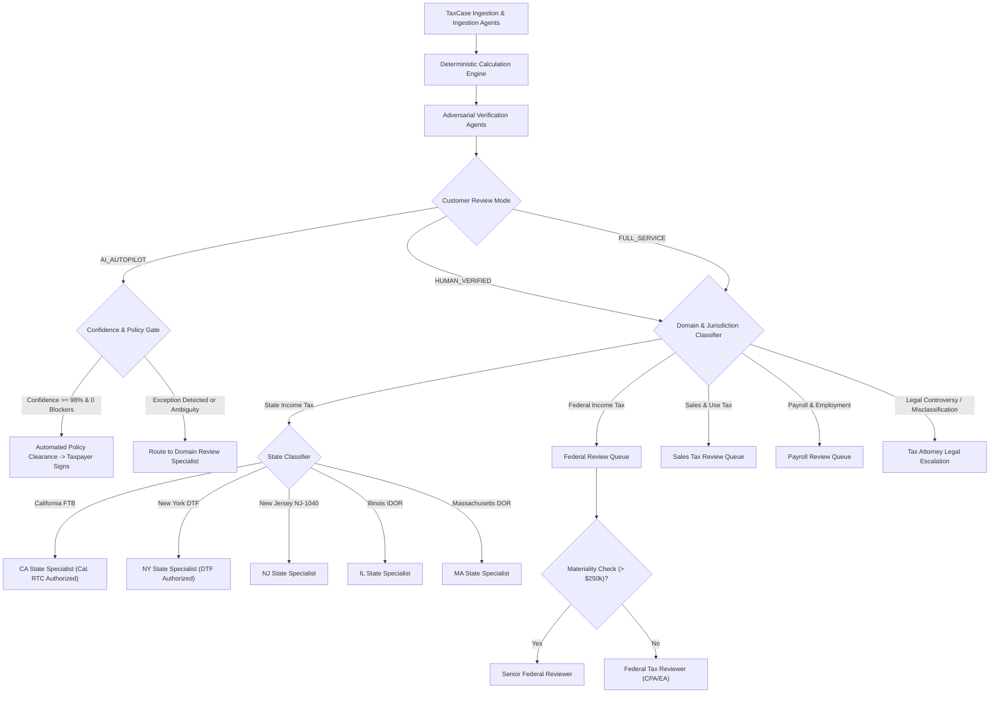

# TaxOS Human Review Architecture & Dynamic Exception Routing

**Document Version:** 3.0.0  
**Design Standard:** Multi-Tier Exception-Driven Routing Engine  
**Core Objective:** Directing tax positions to the exact certified specialist based on domain, jurisdiction, materiality, and legal privilege.

---

## 1. The Human-in-the-Loop Review Philosophy

TaxOS rejects both extremes of modern tax software:
1. **Blind Human Replacement:** We never pretend an unverified LLM can legally or safely sign high-liability tax returns without human review.
2. **Manual Drudgery:** We never force human accountants to perform mindless manual data entry, OCR transcription, or arithmetic verification.

### The Division of Labor:
- **TaxOS AI Engine:** Executes 100% of the ingestion, deduplication, deterministic statutory math, and evidentiary reconciliation. It produces a concise **AI Review Brief** and highlights only anomalies or ambiguities.
- **Certified Human Specialists:** Spend 100% of their time evaluating high-value exceptions, interpreting statutory ambiguity, and advising clients on defensible tax strategy.

---

## 2. Dynamic Routing Flowchart

---

## 3. Review Routing Rules & Routing Policies

### 3.1 Materiality & Complexity Thresholds
- **Tier 1 (Automated Candidate):** Schedule A/B individual return, W-2 + 1099-INT, 100% receipt match, 0 conflicting state rules. Suitable for `AI_AUTOPILOT`.
- **Tier 2 (Standard Specialist Review):** Schedule C expenses >$10,000, multi-state wage allocation, home office deductions (§ 280A). Requires domain reviewer sign-off.
- **Tier 3 (Senior Reviewer Escalation):**
  - Materiality: Tax liability change >$10,000 or gross receipts >$500,000.
  - Multi-jurisdiction apportionment disputes.
  - Section 179 depreciation phase-out thresholds (§ 179(b)(2)).
- **Tier 4 (Legal Counsel Escalation):**
  - Worker classification controversies (independent contractor vs. employee audit risk under Cal. AB 5 or IRS 20-factor test).
  - Potential civil or criminal penalty exposure under IRC § 6662 or § 7201.
  - Matters requiring IRC § 7525 federally authorized tax practitioner confidentiality privilege.

### 3.2 State Licensing & Authorization Safeguards
- A reviewer credentialed exclusively in Illinois cannot view or approve California FTB returns.
- System dynamically matches `TaxCase.jurisdictions` against `Reviewer.authorizedStates`.
- If a return contains both NY and NJ issues (e.g., Manhattan commuter residing in Jersey City), the system routes to a bi-state certified specialist or executes split-task routing.

---

## 4. The Standard Reviewer Workflow & Interface

Every specialist reviewer interacts with a standardized 6-step review cockpit:

1. **AI Review Brief:**
   - Executive 1-page summary generated by TaxOS.
   - Highlights total taxable base, variance from prior tax year, confidence scores, and all non-standard statutory positions.
2. **Evidentiary Lineage Drill-Down:**
   - One-click inspection linking any return line item directly to the source transaction, receipt image, OCR extraction, and SHA-256 hash.
3. **Statutory Authority Grounding:**
   - Reviewer sees the binding statutory citations (e.g., `26 U.S.C. § 162(a)`, `20 NYCRR § 131.18`) supporting each automated deduction.
4. **Exception Resolution:**
   - Reviewer can accept the AI recommendation, modify the deductible dollar amount with an explanatory note, or disallow the claim.
5. **Client Clarification Interaction:**
   - One-click trigger pushing structured clarification cards directly to the taxpayer's "Needs You" inbox (e.g., "Please clarify business purpose for $412 flight").
6. **Immutable Ledger Sign-Off:**
   - Final review action signs the case with the reviewer's PTIN and license hash, appending an unalterable block to the SHA-256 audit DAG.
