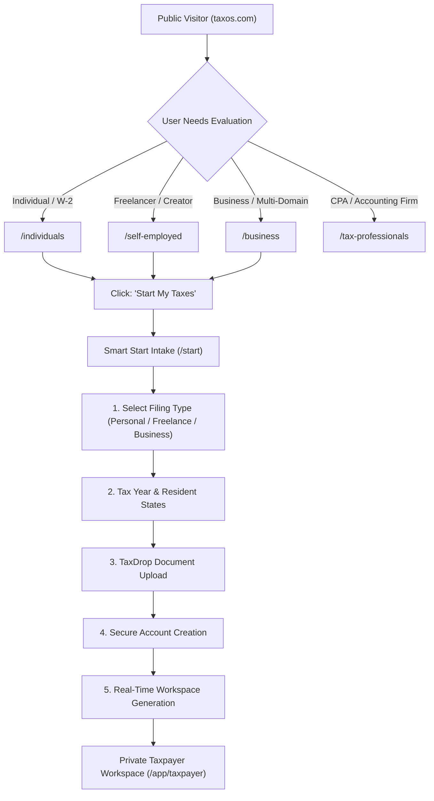

# TaxOS Public Website Information Architecture & Site Map

**Document Version:** 3.0.0  
**Domain Scope:** `taxos.com` (Commercial Public Experience)  
**Target Audience:** U.S. Individual Taxpayers, Freelancers, Creators, Small Business Owners, Corporate Tax Directors, CPAs, EAs, and Tax Attorneys.

---

## 1. Global Navigation Architecture

The public website serves as the primary educational and conversion gateway for TaxOS. It is strictly segregated from internal application telemetry and developer toolbars.

### 1.1 Primary Desktop Navigation Header
- **Brand Identity:** TaxOS logo + Wordmark (linking to `/`)
- **Main Menu Items:**
  1. **Individuals** (`/individuals`)
  2. **Self-Employed** (`/self-employed`)
  3. **Businesses** (`/business`) — with Mega Menu:
     - *Business Income Tax* (`/business/income-tax`)
     - *Sales Tax* (`/sales-tax`)
     - *Payroll Tax* (`/payroll-tax`)
     - *Full Tax OS Overview* (`/business`)
  4. **Tax Professionals** (`/tax-professionals`)
  5. **How It Works** (`/how-it-works`)
  6. **Pricing** (`/pricing`)
  7. **Resources** (`/resources`)
- **Secondary Actions:**
  - **Sign In** (`/signin`) — Subtle text/outline link
  - **Start My Taxes** (`/start`) — High-visibility primary action button (Lime/Forest CTA)

---

## 2. Complete Public Route Hierarchy

| Route | Page Title | Primary Intent | Minimum Target Sections |
| :--- | :--- | :--- | :--- |
| **`/`** | Homepage | Autonomous tax filing value proposition, trust & demo | **12 sections** |
| **`/how-it-works`** | How It Works | End-to-end 5-stage pipeline transparency | **12 sections** |
| **`/individuals`** | Personal Taxes | W-2 earners, families, investments, multi-state moves | **14 sections** |
| **`/self-employed`** | Freelancer & 1099 Taxes | 1099-NEC/K, expense intelligence, mileage, home office | **15 sections** |
| **`/business`** | Business Tax Operating System | Command center for LLCs, S-Corps, C-Corps, Partnerships | **14 sections** |
| **`/business/income-tax`**| Corporate & Entity Income Tax | Form 1120, 1120-S, 1065, QBI § 199A, bonus depreciation | **10 sections** |
| **`/sales-tax`** | Autonomous Sales Tax | Economic nexus, taxability, sourcing, filing calendar | **14 sections** |
| **`/payroll-tax`** | Employment Tax Compliance | Form 941, Form 940, state withholding, SUI, worker status | **15 sections** |
| **`/tax-professionals`**| TaxOS for Accounting Firms | AI pre-accounting, AI Review Brief, exception queues | **15 sections** |
| **`/expert-review`** | Human-in-the-Loop Review | CPA, EA, and Attorney review models and credentials | **10 sections** |
| **`/tax-twin`** | Real-Time Year-Round Simulation | Forward tax projections, entity choice, what-if planning | **10 sections** |
| **`/pricing`** | Transparent Commercial Pricing | Simple tiers ($0, $89, $249), human review add-ons, guarantees| **8 sections** |
| **`/security`** | Enterprise Security & Privacy | SOC 2 Type II, IRS Pub 1075, client encryption, SHA-256 DAG | **12 sections** |
| **`/states`** | Sovereign State Intelligence | Multi-state tax matrix, conformity analysis, residency rules | **10 sections** |
| **`/states/california`** | California Tax (FTB Form 540) | Cal. RTC conformity, HSA add-back, Sec 179 cap, AB 5 worker test| **12 sections** |
| **`/states/new-york`** | New York Tax (DTF IT-201/203) | Convenience of employer rule, 183-day rule, NYC local, PTET | **12 sections** |
| **`/states/new-jersey`**| New Jersey Tax (NJ-1040) | No loss netting ban, property tax deductions, commuter credit | **11 sections** |
| **`/states/illinois`** | Illinois Tax (IDOR IL-1040) | 4.95% flat tax, 100% pension subtraction, property credit | **11 sections** |
| **`/states/massachusetts`**| Massachusetts Tax (DOR Form 1)| Tiered 5% tax, 8.5% ST capital gains, 4% surtax, PFML | **11 sections** |
| **`/resources`** | Tax Knowledge Base & Data | Official 2026 inflation parameters, tax brackets, guides | **8 sections** |
| **`/about`** | About TaxOS | Founding vision, leadership, regulatory advisory board | **8 sections** |
| **`/contact`** | Contact & Enterprise Sales | Support routing, sales inquiries, security disclosures | **6 sections** |
| **`/signin`** | Secure Sign In | Commercial SSO, email/password, role-based destination | **4 sections** |
| **`/start`** | Smart Start Intake | 8-step frictionless consumer onboarding | **8 interactive steps** |

---

## 3. Conversion Funnels & User Journeys

---

## 4. Breadcrumb & Deep-Linking Strategy
- State Pages: `Home > Sovereign States > [State Name]` (e.g., `Home > Sovereign States > California`)
- Business Subpages: `Home > Business > [Domain]` (e.g., `Home > Business > Sales Tax`)
- Clean URL rewrites configured via `vercel.json` ensuring direct bookmarking and refresh operations work without 404 errors.
