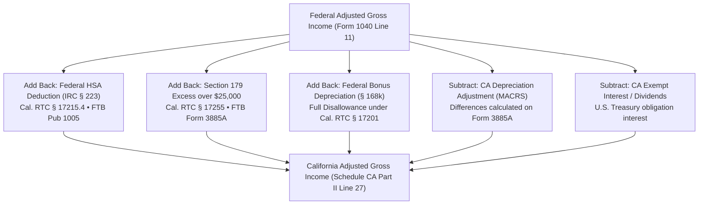

# Autonomous Tax OS — California Tax Knowledge Package (FTB)

> **Status**: Approved Tax Technology Specification  
> **Jurisdiction**: California (`US-CA`)  
> **Tax Authority**: California Franchise Tax Board (FTB)  
> **Target Forms**: Form 540 (Resident), Form 540NR (Nonresident/Part-Year), Schedule CA (540/540NR), Schedule S  

---

## 1. Statutory Foundations & Code Index

The California Tax Package codifies the California Revenue and Taxation Code (RTC) and FTB Administrative Regulations:

```
┌────────────────────────────────────────────────────────────────────────┐
│ TOPIC                    CALIFORNIA STATUTE     REGULATION / GUIDANCE  │
├────────────────────────────────────────────────────────────────────────┤
│ Personal Income Tax      Cal. RTC § 17041       18 CCR § 17041         │
│ Gross Income Definition  Cal. RTC § 17071       Conforms to IRC § 61   │
│ HSA Non-Conformity       Cal. RTC § 17215.4     FTB Pub 1005           │
│ Section 179 $25,000 Cap  Cal. RTC § 17255       FTB Form 3885A         │
│ Bonus Depreciation DisallCal. RTC § 17201       No federal 168(k)      │
│ QBI § 199A Disallowance  Cal. RTC § 17077.5     FTB Notice 2019-01     │
│ Residency & Domicile     Cal. RTC § 17014       FTB Pub 1031           │
│ Mental Health Surtax 1%  Cal. RTC § 17043       1% on taxable > $1M    │
│ Other State Tax Credit   Cal. RTC § 18001       Schedule S             │
└────────────────────────────────────────────────────────────────────────┘
```

---

## 2. Core Non-Conformity Matrices (Schedule CA Adjustments)

California personal income tax uses federal Adjusted Gross Income (AGI) as a starting point, but requires extensive **Schedule CA (540)** additions and subtractions due to specific statutory non-conformity:



### Detailed Statutory Differences:
1. **Health Savings Accounts (HSA)**: California explicitly does not conform to federal HSA legislation.
   * Federal deduction for HSA contributions must be added back to California income.
   * Earnings (interest, dividends, capital gains) generated inside an HSA are taxable in California in the year earned.
2. **Section 179 Expensing Limitation**:
   * Federal limit: $1,220,000+; California limit: strictly capped at **$25,000** under Cal. RTC § 17255.
   * Phase-out begins when qualifying property placed in service exceeds **$200,000** (federal phase-out threshold is >$3M).
3. **Qualified Business Income (QBI)**:
   * California has not enacted conformity to IRC § 199A. The federal 20% pass-through deduction is not permitted in California.
4. **Mental Health Services Tax**:
   * An additional 1% tax applies to California taxable income in excess of $1,000,000 under Proposition 63 (Cal. RTC § 17043).

---

## 3. Residency, Sourcing & Part-Year Allocation (FTB Pub 1031)

* **Resident Definition**: Any individual in California for other than a temporary or transitory purpose, or domiciled in California who is outside the state for a temporary purpose.
* **Closest Connection Test**: Domicile is determined by examining 19 objective factors: location of permanent home, spouse/children location, primary banking, driver's license, vehicle registration, voter registration, professional licenses.
* **Part-Year Allocation (Form 540NR)**: Income received while a resident is 100% California source; income received while a nonresident is taxed only if derived from California sources (business carried on in CA, physical services performed in CA).
