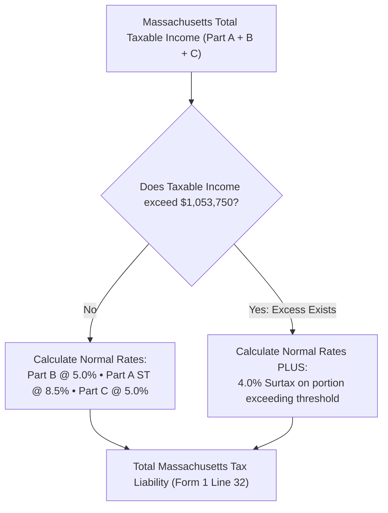

# Autonomous Tax OS — Massachusetts Tax Knowledge Package (DOR)

> **Status**: Approved Tax Technology Specification  
> **Jurisdiction**: Massachusetts (`US-MA`)  
> **Tax Authority**: Massachusetts Department of Revenue (DOR)  
> **Target Forms**: Form 1 (Resident), Form 1-NR/PY (Nonresident/Part-Year), Schedule B (Interest, Dividends, ST Capital Gains), Schedule D (Long-Term Capital Gains), Schedule HC (Health Care)  

---

## 1. Statutory Foundations & Code Index

The Massachusetts Tax Package codifies Massachusetts General Laws (M.G.L. Chapter 62) and DOR Administrative Regulations (830 CMR):

```
┌────────────────────────────────────────────────────────────────────────┐
│ TOPIC                    MASSACHUSETTS STATUTE  ADMINISTRATIVE RULE    │
├────────────────────────────────────────────────────────────────────────┤
│ Part B Income (5.0%)     M.G.L. c. 62, § 4(b)   830 CMR 62.4.1         │
│ Part A ST Gains (8.5%)   M.G.L. c. 62, § 4(a)   Schedule B             │
│ Part C LT Gains (5.0%)   M.G.L. c. 62, § 4(c)   Schedule D             │
│ 4% Fair Share Surtax     M.G.L. c. 62, § 4(d)   TIR 23-12 (>$1M Surtax)│
│ Rent Deduction ($4,000)  M.G.L. c. 62, § 3(B)(a)50% of Rent Paid (Cap) │
│ Charitable Deduction     M.G.L. c. 62, § 3(B)(a)Re-enacted Deduction   │
│ Health Care Mandate      M.G.L. c. 111M, § 2    Schedule HC Penalty    │
└────────────────────────────────────────────────────────────────────────┘
```

---

## 2. Core Massachusetts Statutory Mechanics

### 2.1 The Three-Part Income Classification Architecture
Massachusetts divides income into three discrete statutory baskets, each with unique rate treatments:
1. **Part B Income (5.0%)**: Wages, salaries, tips, pensions, business income (Schedule C), and partnership distributions.
2. **Part A Income (8.5% ST Gains / 5.0% Interest & Dividends)**:
   * Interest and dividends: Taxed at 5.0%.
   * Short-term capital gains (assets held $\le 1$ year): Taxed at **8.5%** under the 2023 Tax Relief Act (M.G.L. c. 62, § 4(a)).
3. **Part C Income (5.0%)**: Long-term capital gains on assets held more than one year.

### 2.2 The 4% Fair Share Amendment Surtax (M.G.L. c. 62, § 4(d))
Under the Massachusetts constitutional amendment ("Millionaires Tax"), an additional surtax applies to high-income taxpayers:
* **The Surtax**: An additional **4.0% tax** is levied on the portion of Massachusetts taxable income exceeding the statutory threshold ($1,000,000 indexed for inflation; $1,053,750 for 2024).
* **Composite Rates**:
  * Ordinary Part B income over threshold: **9.0%** (5.0% base + 4.0% surtax).
  * Short-term capital gains over threshold: **12.5%** (8.5% base + 4.0% surtax).



### 2.3 Massachusetts-Specific Deductions
* **Residential Rent Deduction (M.G.L. c. 62, § 3(B)(a)(9))**: Tenants who pay rent for their principal residence in Massachusetts can deduct **50% of the rent paid**, capped at a maximum deduction of **$2,000** ($4,000 of total rent paid).
* **Schedule HC Health Care Mandate**: Massachusetts requires all residents age 18 and older to maintain minimum creditable health insurance coverage. Failure to maintain coverage without a certificate of hardship triggers a monthly penalty on Schedule HC.
