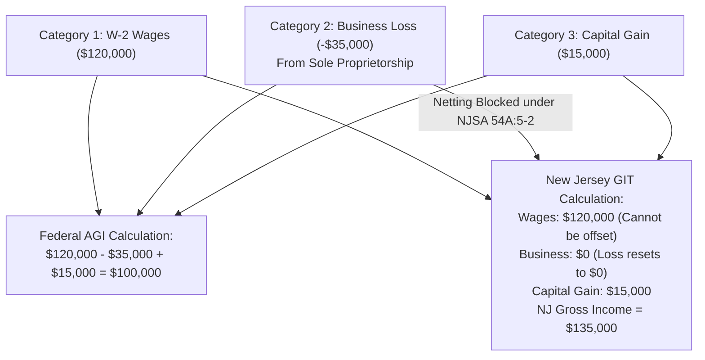

# Autonomous Tax OS — New Jersey Tax Knowledge Package (Division of Taxation)

> **Status**: Approved Tax Technology Specification  
> **Jurisdiction**: New Jersey (`US-NJ`)  
> **Tax Authority**: New Jersey Division of Taxation  
> **Target Forms**: Form NJ-1040 (Resident), Form NJ-1040NR (Nonresident), Schedule NJ-COJ (Credit for Other State Taxes), Schedule NJ-BUS-1 (Business Income Summary)  

---

## 1. Statutory Foundations & Code Index

The New Jersey Tax Package codifies the New Jersey Gross Income Tax Act (N.J.S.A. Title 54A) and NJ Administrative Code (N.J.A.C. 18:35):

```
┌────────────────────────────────────────────────────────────────────────┐
│ TOPIC                    NEW JERSEY STATUTE     ADMINISTRATIVE CODE    │
├────────────────────────────────────────────────────────────────────────┤
│ Gross Income Tax         N.J.S.A. 54A:1-1       N.J.A.C. 18:35-1       │
│ Categories of Income     N.J.S.A. 54A:5-1       16 Explicit Categories │
│ Loss Netting Prohibition N.J.S.A. 54A:5-2       No Cross-Category Net  │
│ Net Profit from Business N.J.S.A. 54A:5-1(b)    Schedule NJ-BUS-1      │
│ Resident Credit (NY Tax) N.J.S.A. 54A:4-1       Schedule NJ-COJ        │
│ Retirement Exclusions    N.J.S.A. 54A:6-10      Pension Exclusion      │
│ Property Tax Deduction   N.J.S.A. 54A:3.5       $15,000 Cap or Credit  │
│ Shared Responsibility    N.J.S.A. 54A:11-1      NJ Health Mandate      │
└────────────────────────────────────────────────────────────────────────┘
```

---

## 2. Core New Jersey Gross Income Tax (GIT) Architecture

### 2.1 The Non-AGI Category Architecture
Unlike federal law and most states, **New Jersey does NOT use federal Adjusted Gross Income as its calculation starting point**. 

New Jersey taxes 16 separate statutory categories of income. Each category is calculated independently:
1. Salaries, wages, tips, and other employee compensation.
2. Net profits from business (Schedule NJ-BUS-1 / Schedule C equivalent).
3. Net gains or income from disposition of property (Capital gains).
4. Net gains from rents, royalties, patents, and copyrights.
5. Interest income.
6. Dividends.
7. Distributive share of partnership income.
8. Net pro rata share of S corporation income.

### 2.2 Strict Prohibition on Cross-Category Loss Netting (N.J.S.A. 54A:5-2)
Under New Jersey statutory law, **a loss in one category cannot offset income in another category**:



> [!CAUTION]
> **New Jersey Audit Invariant**: New Jersey business losses can offset business profits within the same business category, but excess losses cannot offset W-2 wages or investment income, and **cannot be carried forward or carried back to other tax years**.

### 2.3 Schedule NJ-COJ (Credit for Taxes Paid to New York)
For New Jersey residents who commute or telecommute for New York employers, New Jersey provides a resident credit on **Schedule NJ-COJ** for taxes paid to New York State under the Convenience of the Employer rule. The credit is calculated as the lesser of:
* The actual tax paid to New York State on that income; OR
* The New Jersey tax liability on that specific doubly-taxed income tranche.
