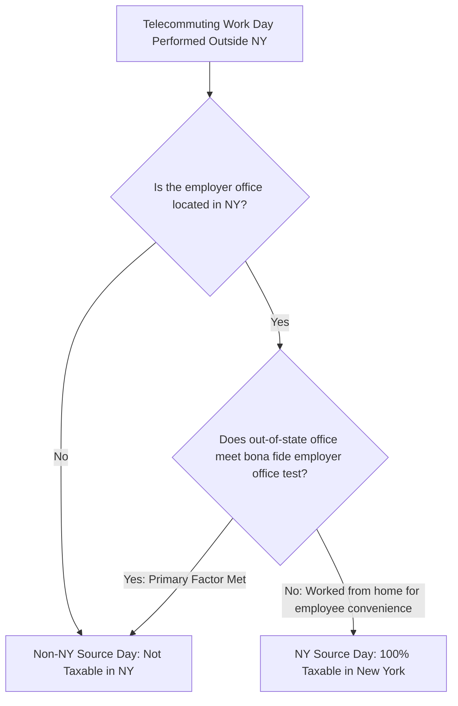

# Autonomous Tax OS — New York Tax Knowledge Package (DTF)

> **Status**: Approved Tax Technology Specification  
> **Jurisdiction**: New York (`US-NY`)  
> **Tax Authority**: New York State Department of Taxation and Finance (DTF)  
> **Target Forms**: Form IT-201 (Resident), Form IT-203 (Nonresident/Part-Year), Form IT-196 (Itemized Deductions), Form IT-112-R (Resident Credit)  

---

## 1. Statutory Foundations & Code Index

The New York Tax Package codifies New York Tax Law Article 22 and DTF Regulations (20 NYCRR):

```
┌────────────────────────────────────────────────────────────────────────┐
│ TOPIC                    NEW YORK STATUTE       REGULATION / GUIDANCE  │
├────────────────────────────────────────────────────────────────────────┤
│ Personal Income Tax      NY Tax Law § 601       20 NYCRR Part 100      │
│ Resident Definition      NY Tax Law § 605(b)    20 NYCRR § 105.20      │
│ Nonresident Taxation     NY Tax Law § 631       20 NYCRR § 132.4       │
│ Convenience of Employer  20 NYCRR § 131.18      TSB-M-06(5)I           │
│ New York City Tax        NY Tax Law Article 30  NYC Admin. Code        │
│ Yonkers Resident Tax     NY Tax Law Article 30-AForm Y-201             │
│ Itemized Deductions      NY Tax Law § 615       Form IT-196            │
│ Resident Tax Credit      NY Tax Law § 620       Form IT-112-R          │
└────────────────────────────────────────────────────────────────────────┘
```

---

## 2. Core New York Statutory Mechanics

### 2.1 The "Convenience of the Employer" Rule (20 NYCRR § 131.18)
Under New York law, if a nonresident employee whose assigned primary office is in New York telecommutes from an out-of-state home (e.g., from New Jersey, Connecticut, or Texas), any day worked from home is deemed a **New York work day** unless the out-of-state home office qualifies as a **bona fide employer office** under *TSB-M-06(5)I*.



### 2.2 Statutory Residency: The 183-Day & Permanent Place of Abode Rule
Under NY Tax Law § 605(b)(1)(B), an individual who is not domiciled in New York is nonetheless taxed as a **Full-Year Statutory Resident** on their worldwide income if they:
1. Maintain a **Permanent Place of Abode (PPA)** in New York State for substantially all of the taxable year (generally $>11$ months); AND
2. Spend in the aggregate more than **183 days** in New York State during the taxable year (any part of a minute spent in NY counts as a full day, excluding transit through NY airports).

### 2.3 New York City (NYC) & Yonkers Local Taxes
* **New York City Resident Tax**: Unlike most municipalities, NYC imposes a progressive personal income tax (ranging from 3.078% to 3.876%) administered directly on Form IT-201. NYC tax applies strictly to individuals domiciled or maintaining statutory residency in the five boroughs of NYC.
* **Yonkers Surcharge**: Residents of Yonkers pay a 16.75% surcharge on their New York State tax; nonresidents earning wages in Yonkers pay a 0.5% earnings tax.

### 2.4 Independent Contractor & Freelance Sourcing
For self-employed 1099 freelancers and sole proprietors filing Schedule C, income is sourced to New York on Form IT-203 based on the location of physical service performance, or based on the allocation of business property and payroll under NY Tax Law § 632.
