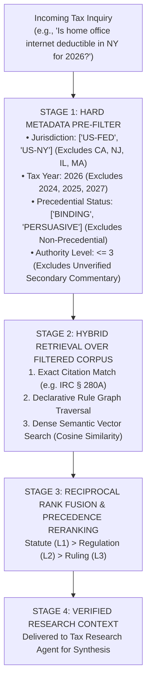

# Autonomous Tax OS — Hybrid Authority Retrieval & Latency Tiers

> **Status**: Approved Tax Technology Specification  
> **Document Version**: 1.0.0  
> **Retrieval Paradigm**: Pre-Filtered Hybrid RAG (Exact Key + Metadata + Dense Vector + Graph Traversal)  
> **Core Mandate**: Filter BEFORE Reasoning — Zero Tolerance for Wrong-Year or Wrong-State Retrieval  

---

## 1. The Pre-Filtered Hybrid Retrieval Pipeline

Autonomous Tax OS rejects naive semantic search that matches general legal concepts across arbitrary jurisdictions. **The retrieval engine executes hard relational filtering BEFORE semantic vector scoring or reasoning.**



---

## 2. The Four Latency Tiers

Tax inquiries span from instant, standard threshold checks to complex multi-jurisdictional litigation disputes. Autonomous Tax OS handles queries across four explicit latency tiers:

```
┌─────────────────────────┬───────────────────────────────┬──────────────────────────────┐
│ LATENCY TIER            │ RESOLUTION MECHANISM          │ LATENCY & TARGET SCOPE       │
├─────────────────────────┼───────────────────────────────┼──────────────────────────────┤
│ L1: STRUCTURED CACHED   │ In-memory hash lookup on the  │ < 10 ms                      │
│ RULE (Instant)          │ compiled Tax Rule Graph       │ Standard mileage, meal caps, │
│                         │                               │ Section 179 thresholds       │
├─────────────────────────┼───────────────────────────────┼──────────────────────────────┤
│ L2: HYBRID AUTHORITY    │ Pre-filtered hybrid vector +  │ < 150 ms                     │
│ RETRIEVAL (Fast)        │ keyword search over Title 26  │ Ordinary & necessary business│
│                         │ and state tax regulations     │ expense classifications      │
├─────────────────────────┼───────────────────────────────┼──────────────────────────────┤
│ L3: DEEP RESEARCH       │ Deep multi-step reasoning     │ < 3.5 seconds                │
│ (Complex)               │ (Claude 3.7 / Gemini 2.5 Pro) │ Sourcing telecommuter wages, │
│                         │ traversing split precedents   │ SSTB classification edges    │
├─────────────────────────┼───────────────────────────────┼──────────────────────────────┤
│ L4: PROFESSIONAL        │ Routed to Enrolled Agent,     │ Async (24 hrs CPA /          │
│ ESCALATION (Human Pro)  │ CPA, or Tax Attorney Queue    │ 4 hrs Attorney)              │
│                         │ via AI Review Brief           │ IRS notices, audit disputes  │
└─────────────────────────┴───────────────────────────────┴──────────────────────────────┘
```

---

## 3. Strict Pre-Filtering Invariants

The `TaxResearchEngine` enforces three mandatory pre-filtering assertions on every query:

```typescript
export function assertRetrievalPreconditions(query: ResearchQuery): void {
  // 1. Mandatory Tax Year Filter
  if (!query.taxYear || query.taxYear < 2020 || query.taxYear > 2030) {
    throw new Error(`[RETRIEVAL REJECTED]: Invalid or missing taxYear: ${query.taxYear}`);
  }

  // 2. Mandatory Jurisdiction Scope Filter
  const validJurisdictions = ['US-FED', 'US-CA', 'US-NY', 'US-NJ', 'US-IL', 'US-MA'];
  if (!query.jurisdiction || !validJurisdictions.includes(query.jurisdiction)) {
    throw new Error(`[RETRIEVAL REJECTED]: Unauthorized jurisdiction '${query.jurisdiction}'.`);
  }

  // 3. Precedential Filtering
  if (query.excludeNonPrecedential === undefined) {
    query.excludeNonPrecedential = true; // Default to binding primary authority
  }
}
```

Any retrieval candidate whose metadata does not match `query.taxYear` and `query.jurisdiction` is discarded before reaching the reranker. **Wrong-year and wrong-state leakage is mathematically prevented.**
