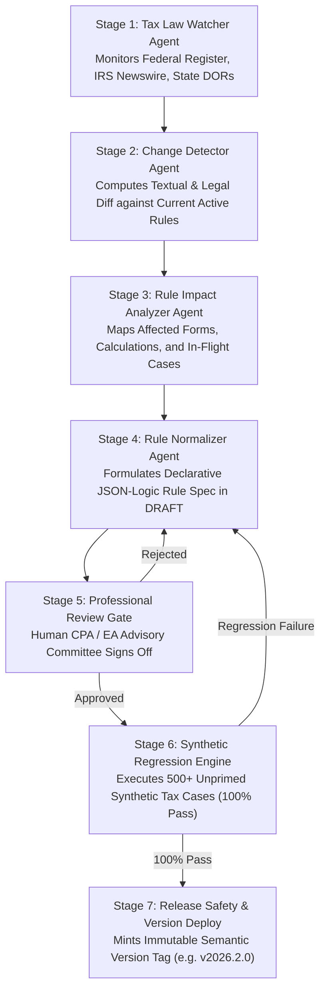

# Autonomous Tax OS — Tax Law Update Pipeline & Version Governance

> **Status**: Approved Tax Technology Specification  
> **Document Version**: 1.0.0  
> **Governance Standard**: Seven-Stage Staged Gate Deployment Pipeline  
> **Core Mandate**: Never Silently Overwrite Rules — 100% Return Reproducibility  

---

## 1. The Seven-Stage Rule Update Workflow

When tax legislation is enacted (e.g., congressional tax reform, annual IRS inflation indexing, state conformity decoupling), Autonomous Tax OS updates its Tax Rule Graph through a formal seven-stage pipeline:

---

## 2. Immutable Rule Versioning & Return Reproducibility

> [!IMPORTANT]
> **Return Reproducibility Invariant**: Every `TaxCase` stores the exact rule set version keys applied during preparation (e.g., `federalRuleSetVersion: "2026.1.0"`, `californiaRuleSetVersion: "2026.1.0"`). A return prepared in 2026 and audited in 2030 can be re-evaluated bit-for-bit against the exact 2026 rule graph snapshot.

### Version Tagging Lifecycle:
1. **DRAFT**: Newly generated rule undergoing impact analysis and test execution.
2. **ACTIVE**: Current authoritative rule applied to all newly calculated returns for that tax year.
3. **SUPERSEDED**: Prior rule preserved for historical reproducibility when a mid-year update occurs.
4. **DEPRECATED**: Sunset rule whose statutory authority has expired by law (e.g., expired temporary tax credits).

---

## 3. Emergency Rule Rollback & Circuit Breakers

If an active rule is found to contain an unforeseen ambiguity or calculation conflict post-deployment:
1. **Instant Rollback**: The `KillSwitchManager` trips `SPECIFIC_TAX_RULE:rule_id`, instantly reverting calculation routines to the prior verified rule version (`2026.1.0`).
2. **Case Impact Quarantine**: The `RuleImpactAnalyzer` queries all in-flight cases that utilized the flawed version and flags them for automated recalculation before e-filing transmission.
